# 🚀 RingCentral多智能体系统 - 部署指南

## 📋 **部署架构概览**

### **构建产物流向图**
```
源代码 → 构建阶段 → 产物生成 → 部署目标
   ↓         ↓         ↓         ↓
GitHub → CI/CD → Docker镜像 → Kubernetes集群
   ↓         ↓         ↓         ↓
  推送 → GitHub Actions → 容器注册表 → 生产环境
```

## 🏗️ **构建产物详解**

### **1. JAR文件产物**
| 产物类型 | 位置 | 用途 |
|----------|------|------|
| **应用JAR** | `*/build/libs/*-1.0.0.jar` | 可执行的Spring Boot应用 |
| **源码JAR** | `*/build/libs/*-1.0.0-sources.jar` | 源代码归档 |
| **文档JAR** | `*/build/libs/*-1.0.0-javadoc.jar` | API文档归档 |

### **2. Docker镜像产物**
| 服务名称 | 镜像标签 | 注册表位置 |
|----------|----------|------------|
| **API Gateway** | `ringcentral/api-gateway:${GITHUB_SHA}` | Docker Hub/私有注册表 |
| **Auth Service** | `ringcentral/auth-service:${GITHUB_SHA}` | Docker Hub/私有注册表 |
| **Meeting Agent** | `ringcentral/meeting-agent:${GITHUB_SHA}` | Docker Hub/私有注册表 |
| **Call Agent** | `ringcentral/call-agent:${GITHUB_SHA}` | Docker Hub/私有注册表 |
| **Speech Engine** | `ringcentral/speech-engine:${GITHUB_SHA}` | Docker Hub/私有注册表 |
| **NLU Engine** | `ringcentral/nlu-engine:${GITHUB_SHA}` | Docker Hub/私有注册表 |

### **3. 测试报告产物**
| 报告类型 | 位置 | 用途 |
|----------|------|------|
| **单元测试报告** | `*/build/reports/tests/` | 代码质量验证 |
| **集成测试报告** | `tests/integration-tests/build/reports/` | 服务集成验证 |
| **E2E测试报告** | `tests/e2e-tests/build/reports/` | 端到端功能验证 |
| **性能测试报告** | `tests/performance-tests/build/reports/` | 性能基准验证 |
| **代码覆盖率报告** | `*/build/reports/jacoco/` | 测试覆盖率分析 |

## 🎯 **自动部署流程**

### **触发条件**
| 分支 | 触发条件 | 部署目标 | 自动化程度 |
|------|----------|----------|------------|
| **develop** | 推送代码 | 开发环境 | **100%自动** |
| **main** | 推送代码 | 生产环境 | **需要审批** |
| **feature/** | PR创建 | 无部署 | 仅构建测试 |

### **部署流水线**

```mermaid
graph LR
    A[代码推送] --> B[构建镜像]
    B --> C[推送注册表]
    C --> D[部署到K8s]
    D --> E[健康检查]
    E --> F[通知完成]
    
    style A fill:#e1f5fe
    style B fill:#fff3e0
    style C fill:#f3e5f5
    style D fill:#e8f5e8
    style E fill:#fff8e1
    style F fill:#e0f2f1
```


## 🌐 **部署目标环境**

### **开发环境 (Development)**
- **命名空间**: `ringcentral-dev`
- **域名**: `dev-api.ringcentral.com`
- **副本数**: 1-2个副本
- **资源配置**: 基础配置
- **数据库**: PostgreSQL单实例
- **缓存**: Redis单实例
- **自动部署**: ✅ develop分支推送时

### **生产环境 (Production)**
- **命名空间**: `ringcentral-prod`
- **域名**: `api.ringcentral.prod`
- **副本数**: 3-20个副本(自动扩缩容)
- **资源配置**: 高性能配置
- **数据库**: PostgreSQL集群(3副本)
- **缓存**: Redis集群(3副本)
- **自动部署**: ⚠️ main分支推送时(需要审批)

## 🔧 **部署配置详解**

### **Kubernetes资源配置**

#### **开发环境资源**
```yaml
resources:
  requests:
    memory: "512Mi"
    cpu: "250m"
  limits:
    memory: "1Gi"
    cpu: "500m"
```

#### **生产环境资源**
```yaml
resources:
  requests:
    memory: "2Gi"
    cpu: "1000m"
  limits:
    memory: "4Gi"
    cpu: "2000m"
```

### **高可用配置**

#### **API Gateway (生产环境)**
- **副本数**: 5个基础副本
- **自动扩缩容**: 5-20个副本
- **扩容指标**: CPU 70%, 内存 80%
- **滚动更新**: 最大增加2个，最大不可用1个

#### **数据库集群**
- **PostgreSQL**: 3副本StatefulSet
- **Redis**: 3副本集群模式
- **持久化存储**: 100GB(PostgreSQL), 50GB(Redis)

## 🔍 **部署验证**

### **自动健康检查**
```bash
# 检查Pod状态
kubectl get pods -n ringcentral-prod

# 检查服务状态
kubectl get services -n ringcentral-prod

# 检查Ingress状态
kubectl get ingress -n ringcentral-prod
```

### **应用健康检查**
- **存活探针**: `/actuator/health` (60s后开始，30s间隔)
- **就绪探针**: `/actuator/health/readiness` (30s后开始，10s间隔)

## 📊 **部署监控**

### **关键指标**
| 指标 | 阈值 | 告警 |
|------|------|------|
| **Pod可用性** | < 80% | 立即告警 |
| **响应时间** | > 2秒 | 警告 |
| **错误率** | > 5% | 立即告警 |
| **CPU使用率** | > 80% | 警告 |
| **内存使用率** | > 85% | 警告 |

### **部署通知**
- **成功部署**: Slack/邮件通知
- **部署失败**: 立即告警
- **回滚触发**: 自动通知

## 🔄 **回滚策略**

### **自动回滚条件**
- 健康检查失败超过5分钟
- 错误率超过10%
- 服务不可用超过3分钟

### **手动回滚命令**
```bash
# 回滚到上一个版本
kubectl rollout undo deployment/api-gateway -n ringcentral-prod

# 回滚到指定版本
kubectl rollout undo deployment/api-gateway --to-revision=2 -n ringcentral-prod
```

## 🔐 **安全配置**

### **密钥管理**
- **数据库密码**: Kubernetes Secret
- **API密钥**: 环境变量注入
- **TLS证书**: cert-manager自动管理

### **网络安全**
- **Ingress**: NGINX + SSL终止
- **内部通信**: Service Mesh(可选)
- **网络策略**: Pod间访问控制

## 📋 **部署检查清单**

### **部署前检查**
- [ ] 代码已通过所有测试
- [ ] Docker镜像构建成功
- [ ] 数据库迁移脚本准备
- [ ] 配置文件更新
- [ ] 监控告警配置

### **部署后验证**
- [ ] 所有Pod运行正常
- [ ] 服务健康检查通过
- [ ] API接口响应正常
- [ ] 数据库连接正常
- [ ] 缓存服务正常
- [ ] 监控指标正常

## 🚨 **故障排除**

### **常见问题**
1. **Pod启动失败**: 检查资源限制和镜像拉取
2. **服务不可达**: 检查Service和Ingress配置
3. **数据库连接失败**: 检查密钥和网络策略
4. **内存溢出**: 调整JVM参数和资源限制

### **日志查看**
```bash
# 查看Pod日志
kubectl logs -f deployment/api-gateway -n ringcentral-prod

# 查看事件
kubectl get events -n ringcentral-prod --sort-by='.lastTimestamp'
```

## 📞 **支持联系**

- **DevOps团队**: devops@ringcentral.com
- **紧急联系**: +1-xxx-xxx-xxxx
- **监控面板**: https://monitoring.ringcentral.com
- **日志平台**: https://logs.ringcentral.com

---

**最后更新**: 2024年12月
**版本**: v2.0
**状态**: ✅ 生产就绪 