# RingCentral企业级AI智能体协同平台架构设计

## 📋 文档大纲

### **1. 项目概述 (Project Overview)**
- [1.1 项目背景与目标](#11-项目背景与目标)
- [1.2 业务需求分析](#12-业务需求分析)
- [1.3 解决方案价值](#13-解决方案价值)
- [1.4 技术要求对齐](#14-技术要求对齐)

### **2. 需求分析 (Requirements Analysis)**
- [2.1 功能需求](#21-功能需求)
- [2.2 非功能需求](#22-非功能需求)
- [2.3 约束条件](#23-约束条件)
- [2.4 成功标准](#24-成功标准)

### **3. 系统架构设计 (System Architecture)**
- [3.1 业务架构](#31-业务架构)
- [3.2 应用架构](#32-应用架构)
- [3.3 技术架构](#33-技术架构)
- [3.4 数据架构](#34-数据架构)
- [3.5 部署架构](#35-部署架构)
- [3.6 安全架构](#36-安全架构)

### **4. 详细设计 (Detailed Design)**
- [4.1 工程结构设计](#41-工程结构设计)
- [4.2 关键流程时序图](#42-关键流程时序图)
  - [4.2.1 会议智能体处理流程](#421-会议智能体处理流程)
  - [4.2.2 通话智能体情感分析流程](#422-通话智能体情感分析流程)
  - [4.2.3 路由智能体负载均衡流程](#423-路由智能体负载均衡流程)
  - [4.2.4 多LLM供应商切换流程](#424-多llm供应商切换流程)
  - [4.2.5 RAG知识检索流程](#425-rag知识检索流程)
  - [4.2.6 用户认证授权流程](#426-用户认证授权流程)
  - [4.2.7 实时通信WebSocket流程](#427-实时通信websocket流程)
  - [4.2.8 数据同步与一致性流程](#428-数据同步与一致性流程)
  - [4.2.9 错误处理与故障恢复流程](#429-错误处理与故障恢复流程)
- [4.3 智能体设计](#43-智能体设计)
- [4.4 核心引擎设计](#44-核心引擎设计)
- [4.5 接口设计](#45-接口设计)
- [4.6 数据模型设计](#46-数据模型设计)

### **5. 技术实现 (Technical Implementation)**
- [5.1 开发框架与技术栈](#51-开发框架与技术栈)
- [5.2 核心算法实现](#52-核心算法实现)
- [5.3 系统集成方案](#53-系统集成方案)
- [5.4 第三方服务集成](#54-第三方服务集成)

### **6. 质量保证 (Quality Assurance)**
- [6.1 性能优化策略](#61-性能优化策略)
- [6.2 安全设计](#62-安全设计)
- [6.3 可靠性设计](#63-可靠性设计)
- [6.4 测试策略](#64-测试策略)

### **7. 运维管理 (Operations Management)**
- [7.1 部署方案](#71-部署方案)
- [7.2 监控体系](#72-监控体系)
- [7.3 运维流程](#73-运维流程)
- [7.4 故障处理](#74-故障处理)

### **8. 项目管理 (Project Management)**
- [8.1 实施计划](#81-实施计划)
- [8.2 风险评估](#82-风险评估)
- [8.3 资源配置](#83-资源配置)
- [8.4 成本效益分析](#84-成本效益分析)

---

## 1. 项目概述 (Project Overview)

### 1.1 项目背景与目标

基于RingCentral统一通信平台，设计一个面向企业级通信场景的AI智能体协同平台。系统通过多个专业化AI Agent的协同工作，为RingCentral的核心产品（RingCentral MVP、RingCentral Video、RingCentral Contact Center）提供智能化增强，包括智能会议助手、通话分析、客户服务优化、通信路由等功能。

**项目目标**：
- 🎯 **智能化升级**：为RingCentral产品线提供AI能力增强
- 🚀 **效率提升**：通过智能体协同提升通信效率30%以上
- 📊 **数据驱动**：实现实时通信数据分析和智能决策
- 🔄 **无缝集成**：与现有RingCentral生态系统深度集成

### 1.2 业务需求分析

**RingCentral产品集成场景**：
- 📞 **RingCentral MVP**: 云电话系统的智能呼叫路由和语音分析
- 🎥 **RingCentral Video**: 视频会议的智能摘要和实时翻译
- 🎧 **Contact Center**: 客户服务的智能质检和情感分析
- 💬 **RingCentral Message**: 团队协作的智能助手和内容分析
- 📊 **RingCentral Analytics**: 通信数据的智能洞察和预测

### 1.3 解决方案价值

- 🚀 **通信效率提升**: 通过智能化处理减少人工干预，显著提升用户体验
- 🎯 **智能化服务**: 通过多智能体协同，提供个性化通信解决方案
- 📊 **数据驱动洞察**: 实时分析通信行为和质量，持续优化业务流程
- 🔄 **全场景覆盖**: 覆盖语音、视频、消息、客服等全通信场景

### 1.4 技术要求对齐

本系统设计完全符合RingCentral的技术要求，采用Java/Kotlin微服务架构，集成qDrant向量数据库，支持LangChain/AutoGen智能体框架，详细对齐分析请参见文档末尾章节。

---

## 2. 需求分析 (Requirements Analysis)

### 2.1 功能需求

**核心功能模块**：

1. **智能会议助手**
   - 实时语音转录和多语言翻译
   - 自动会议摘要和行动项提取
   - 参与度分析和会议效果评估

2. **智能通话分析**
   - 实时通话质量监控
   - 客户情绪识别和预警
   - 销售机会识别和话术推荐

3. **智能客服质检**
   - 100%通话质检覆盖
   - 实时客服辅助和知识推荐
   - 客户满意度预测和风险预警

4. **智能协作优化**
   - 消息重要性智能分类
   - 工作流程瓶颈识别
   - 资源调度优化建议

### 2.2 非功能需求

**性能要求**：
- 系统响应时间 ≤ 200ms
- 并发用户支持 ≥ 10,000
- 系统可用性 ≥ 99.9%
- 数据处理吞吐量 ≥ 1000 TPS

**可扩展性要求**：
- 支持水平扩展
- 微服务架构
- 容器化部署
- 多云环境支持

**安全要求**：
- 企业级身份认证
- 数据传输加密
- 访问权限控制
- 审计日志记录

### 2.3 约束条件

**技术约束**：
- 必须与RingCentral现有API和SDK兼容
- 支持企业级安全和合规要求
- 满足实时通信的低延迟要求
- 使用指定的qDrant向量数据库

**业务约束**：
- 不能影响现有RingCentral产品的稳定性
- 需要支持多租户和大规模并发
- 符合各国数据保护法规要求
- 预算控制在合理范围内

### 2.4 成功标准

**技术指标**：
- 系统可用性 ≥ 99.9%
- 响应时间 ≤ 200ms
- 并发用户支持 ≥ 10,000
- AI模型准确率 ≥ 95%

**业务指标**：
- 会议效率提升 ≥ 30%
- 客户满意度提升 ≥ 15%
- 运营成本降低 ≥ 25%
- 用户采用率 ≥ 80%

---

## 3. 系统架构设计 (System Architecture)

### 3.1 业务架构

**业务能力地图**：

```plantuml
@startuml
!define RECTANGLE class

package "RingCentral业务域" {
  RECTANGLE "统一通信平台" as UC
  RECTANGLE "语音通信(MVP)" as Voice
  RECTANGLE "视频会议" as Video  
  RECTANGLE "即时消息" as Message
  RECTANGLE "联络中心" as Contact
  RECTANGLE "分析洞察" as Analytics
}

package "RingSense AI增强能力域" {
  RECTANGLE "智能路由" as Router
  RECTANGLE "实时转录" as Transcription
  RECTANGLE "情感分析" as Emotion
  RECTANGLE "智能摘要" as Summary
  RECTANGLE "质量监控" as Quality
  RECTANGLE "预测分析" as Prediction
}

package "业务价值" {
  RECTANGLE "效率提升" as Efficiency
  RECTANGLE "成本降低" as Cost
  RECTANGLE "体验优化" as Experience
  RECTANGLE "决策支持" as Decision
}

UC --> Voice
UC --> Video
UC --> Message
UC --> Contact
UC --> Analytics

Router --> Voice
Transcription --> Voice
Transcription --> Video
Emotion --> Voice
Emotion --> Contact
Summary --> Video
Summary --> Message
Quality --> Contact
Prediction --> Analytics

Router --> Efficiency
Transcription --> Efficiency
Emotion --> Experience
Summary --> Efficiency
Quality --> Cost
Prediction --> Decision

@enduml
```

**业务流程架构**：

1. **智能会议流程**
   - 会议发起 → 智能体激活 → 实时处理 → 结果输出 → 后续跟进

2. **智能客服流程**
   - 客户来电 → 智能路由 → 实时辅助 → 质量监控 → 效果评估

3. **智能分析流程**
   - 数据采集 → 实时处理 → 模式识别 → 洞察生成 → 决策支持

### 3.2 应用架构

**应用分层架构**：

```plantuml
@startuml
!define RECTANGLE class

package "表示层 (Presentation Layer)" {
  RECTANGLE "Web Portal" as Web
  RECTANGLE "Mobile App" as Mobile
  RECTANGLE "Desktop Client" as Desktop
  RECTANGLE "API Gateway" as Gateway
}

package "业务服务层 (Business Service Layer)" {
  RECTANGLE "会议智能体服务" as MeetingAgent
  RECTANGLE "通话智能体服务" as CallAgent
  RECTANGLE "路由智能体服务" as RouterAgent
  RECTANGLE "分析智能体服务" as AnalyticsAgent
  RECTANGLE "协调智能体服务" as CoordinatorAgent
}

package "AI能力层 (AI Capability Layer)" {
  RECTANGLE "语音处理引擎" as SpeechEngine
  RECTANGLE "自然语言理解" as NLUEngine
  RECTANGLE "情感计算引擎" as EmotionEngine
  RECTANGLE "知识检索引擎" as KnowledgeEngine
  RECTANGLE "推理决策引擎" as ReasoningEngine
}

package "平台服务层 (Platform Service Layer)" {
  RECTANGLE "身份认证服务" as AuthService
  RECTANGLE "配置管理服务" as ConfigService
  RECTANGLE "监控告警服务" as MonitorService
  RECTANGLE "消息队列服务" as MessageService
  RECTANGLE "缓存服务" as CacheService
}

package "数据服务层 (Data Service Layer)" {
  RECTANGLE "PostgreSQL" as PostgreSQL
  RECTANGLE "qDrant向量数据库" as QDrant
  RECTANGLE "Redis缓存" as Redis
  RECTANGLE "对象存储" as ObjectStorage
  RECTANGLE "搜索引擎" as SearchEngine
}

Web --> Gateway
Mobile --> Gateway
Desktop --> Gateway

Gateway --> MeetingAgent
Gateway --> CallAgent
Gateway --> RouterAgent
Gateway --> AnalyticsAgent
Gateway --> CoordinatorAgent

MeetingAgent --> SpeechEngine
MeetingAgent --> NLUEngine
CallAgent --> SpeechEngine
CallAgent --> EmotionEngine
RouterAgent --> KnowledgeEngine
RouterAgent --> ReasoningEngine
AnalyticsAgent --> NLUEngine
AnalyticsAgent --> KnowledgeEngine
CoordinatorAgent --> ReasoningEngine

MeetingAgent --> AuthService
CallAgent --> ConfigService
RouterAgent --> MonitorService
AnalyticsAgent --> MessageService
CoordinatorAgent --> CacheService

SpeechEngine --> PostgreSQL
NLUEngine --> QDrant
EmotionEngine --> Redis
KnowledgeEngine --> ObjectStorage
ReasoningEngine --> SearchEngine

@enduml
```

**微服务架构设计**：

```plantuml
@startuml
!define MICROSERVICE rectangle

package "智能体服务集群" {
  MICROSERVICE "meeting-agent-service\n会议智能体\n(Java/Kotlin)" as MeetingService
  MICROSERVICE "call-agent-service\n通话智能体\n(Java/Kotlin)" as CallService
  MICROSERVICE "router-agent-service\n路由智能体\n(Java/Kotlin)" as RouterService
  MICROSERVICE "analytics-agent-service\n分析智能体\n(Java/Kotlin)" as AnalyticsService
  MICROSERVICE "coordinator-agent-service\n协调智能体\n(Java/Kotlin)" as CoordinatorService
}

package "AI引擎服务集群" {
  MICROSERVICE "speech-engine-service\n语音处理引擎\n(Java/Kotlin)" as SpeechService
  MICROSERVICE "nlu-engine-service\n自然语言理解\n(Java/Kotlin)" as NLUService
  MICROSERVICE "emotion-engine-service\n情感计算引擎\n(Java/Kotlin)" as EmotionService
  MICROSERVICE "knowledge-engine-service\n知识检索引擎\n(Java/Kotlin)" as KnowledgeService
  MICROSERVICE "reasoning-engine-service\n推理决策引擎\n(Java/Kotlin)" as ReasoningService
}

package "平台基础服务" {
  MICROSERVICE "api-gateway\nAPI网关\n(Spring Cloud Gateway)" as Gateway
  MICROSERVICE "auth-service\n认证授权\n(Java/Kotlin)" as AuthService
  MICROSERVICE "config-service\n配置中心\n(Spring Cloud Config)" as ConfigService
  MICROSERVICE "monitor-service\n监控服务\n(Java/Kotlin)" as MonitorService
  MICROSERVICE "message-service\n消息服务\n(Apache Kafka)" as MessageService
}

package "LLM集成层" {
  MICROSERVICE "OpenAI GPT-4" as OpenAI
  MICROSERVICE "Azure OpenAI" as Azure
  MICROSERVICE "AWS Bedrock" as Bedrock
  MICROSERVICE "Anthropic Claude" as Claude
  MICROSERVICE "Google Gemini" as Gemini
}

package "数据存储层" {
  database "PostgreSQL\n关系数据库" as PostgreSQL
  database "qDrant\n向量数据库" as QDrant
  database "Redis\n缓存数据库" as Redis
}

Gateway --> MeetingService
Gateway --> CallService
Gateway --> RouterService
Gateway --> AnalyticsService
Gateway --> CoordinatorService

MeetingService --> SpeechService
MeetingService --> NLUService
CallService --> SpeechService
CallService --> EmotionService
RouterService --> KnowledgeService
RouterService --> ReasoningService
AnalyticsService --> NLUService
AnalyticsService --> KnowledgeService
CoordinatorService --> ReasoningService

NLUService --> OpenAI
NLUService --> Azure
ReasoningService --> Bedrock
KnowledgeService --> Claude
SpeechService --> Gemini

MeetingService --> PostgreSQL
CallService --> PostgreSQL
NLUService --> QDrant
KnowledgeService --> QDrant
EmotionService --> Redis

note right of Gateway : REST API + GraphQL\nWebSocket支持
note right of MessageService : Apache Kafka\n异步消息处理
note right of QDrant : 向量检索\nRAG支持

@enduml
```

**技术栈对齐JD要求**：

```yaml
核心技术栈:
  后端语言: Java 17, Kotlin 1.9 (JD要求)
  微服务框架: Spring Boot 3.x, Spring Cloud 2023.x
  数据库: 
    - PostgreSQL 15+ (JD要求)
    - Redis 7.x (JD要求)
    - qDrant 1.7+ (JD明确要求的向量数据库)
  
  LLM编排框架:
    - LangChain 0.1+ (JD要求)
    - LlamaIndex 0.9+ (JD要求)
    - AutoGen 0.2+ (JD要求)
  
  LLM供应商集成:
    - OpenAI GPT-4 (JD要求)
    - Azure OpenAI (JD要求)
    - AWS Bedrock (JD要求)
    - Anthropic Claude (JD要求)
    - Google Gemini (JD要求)
  
  API设计:
    - REST API (JD要求)
    - GraphQL API (JD要求)
    - WebSocket实时通信 (JD要求)
  
  云平台: AWS/Azure/GCP (JD要求)
  认证授权: OAuth 2.0, JWT (JD要求)
  
服务通信:
  同步通信: REST API, GraphQL
  异步通信: Apache Kafka, WebSocket
  服务发现: Spring Cloud Eureka
  负载均衡: Spring Cloud LoadBalancer
```

### 3.3 技术架构

**技术栈架构**：

```plantuml
@startuml
!define TECH rectangle

package "前端技术栈" {
  TECH "React 18" as React
  TECH "TypeScript" as TS
  TECH "WebSocket" as WS
  TECH "PWA" as PWA
}

package "后端技术栈 (JD要求)" {
  TECH "Java 17" as Java
  TECH "Kotlin 1.9" as Kotlin
  TECH "Spring Boot 3.x" as SpringBoot
  TECH "Spring Cloud 2023.x" as SpringCloud
  TECH "Spring Security" as SpringSecurity
}

package "AI/ML技术栈 (JD要求)" {
  TECH "LangChain 0.1+" as LangChain
  TECH "AutoGen 0.2+" as AutoGen
  TECH "LlamaIndex 0.9+" as LlamaIndex
  TECH "提示工程" as PromptEng
  TECH "思维链推理" as ChainOfThought
}

package "LLM供应商 (JD要求)" {
  TECH "OpenAI GPT-4" as OpenAI
  TECH "Azure OpenAI" as AzureAI
  TECH "AWS Bedrock" as Bedrock
  TECH "Anthropic Claude" as Claude
  TECH "Google Gemini" as Gemini
}

package "数据技术栈 (JD要求)" {
  TECH "PostgreSQL 15+" as PostgreSQL
  TECH "qDrant 1.7+" as QDrant
  TECH "Redis 7.x" as Redis
  TECH "向量检索" as VectorSearch
  TECH "RAG管道" as RAG
}

package "API技术栈 (JD要求)" {
  TECH "REST API" as REST
  TECH "GraphQL" as GraphQL
  TECH "WebSocket" as WebSocketAPI
  TECH "实时通信" as RealTime
}

package "云平台 (JD要求)" {
  TECH "AWS" as AWS
  TECH "Azure" as Azure
  TECH "GCP" as GCP
  TECH "微服务架构" as Microservices
  TECH "分布式系统" as Distributed
}

package "认证授权 (JD要求)" {
  TECH "OAuth 2.0" as OAuth
  TECH "JWT Token" as JWT
  TECH "RBAC" as RBAC
}

React --> Java
TS --> Kotlin
WS --> SpringBoot
PWA --> SpringCloud

Java --> LangChain
Kotlin --> AutoGen
SpringBoot --> LlamaIndex
SpringSecurity --> PromptEng

LangChain --> OpenAI
AutoGen --> AzureAI
LlamaIndex --> Bedrock
PromptEng --> Claude
ChainOfThought --> Gemini

OpenAI --> PostgreSQL
AzureAI --> QDrant
Bedrock --> Redis
Claude --> VectorSearch
Gemini --> RAG

PostgreSQL --> REST
QDrant --> GraphQL
Redis --> WebSocketAPI
VectorSearch --> RealTime

REST --> AWS
GraphQL --> Azure
WebSocketAPI --> GCP
RealTime --> Microservices

AWS --> OAuth
Azure --> JWT
GCP --> RBAC

note right of QDrant : JD明确要求的\n向量数据库
note right of LangChain : JD要求的\nLLM编排框架
note right of OpenAI : JD要求集成的\n多个LLM供应商

@enduml
```

**核心技术选型 (完全对齐JD要求)**：

| 技术领域 | 技术选型 | 版本 | JD要求匹配 | 选型理由 |
|---------|---------|------|-----------|---------|
| **后端语言** | Java | 17 | ✅ JD明确要求 | 强大的编程技能要求 |
| **后端语言** | Kotlin | 1.9 | ✅ JD明确要求 | 现代JVM语言，与Java互操作 |
| **微服务框架** | Spring Boot | 3.2.x | ✅ 分布式系统要求 | 构建微服务架构的核心框架 |
| **微服务治理** | Spring Cloud | 2023.x | ✅ 云原生应用要求 | 微服务治理完整解决方案 |
| **关系数据库** | PostgreSQL | 15+ | ✅ JD明确要求 | 企业级关系数据库 |
| **缓存数据库** | Redis | 7.x | ✅ JD明确要求 | 高性能内存数据库 |
| **向量数据库** | qDrant | 1.7+ | ✅ JD明确要求 | 专门要求的向量数据库 |
| **API设计** | REST API | - | ✅ JD明确要求 | RESTful API设计与开发 |
| **API设计** | GraphQL | - | ✅ JD明确要求 | 现代API查询语言 |
| **实时通信** | WebSocket | - | ✅ JD明确要求 | 实时通信系统 |
| **LLM编排** | LangChain | 0.1+ | ✅ JD明确要求 | 大语言模型编排框架 |
| **LLM编排** | LlamaIndex | 0.9+ | ✅ JD明确要求 | RAG和向量检索框架 |
| **多智能体** | AutoGen | 0.2+ | ✅ JD明确要求 | 智能体协作框架 |
| **云平台** | AWS | - | ✅ JD明确要求 | 云平台服务 |
| **云平台** | Azure | - | ✅ JD明确要求 | 微软云服务 |
| **云平台** | GCP | - | ✅ JD明确要求 | 谷歌云服务 |
| **认证授权** | OAuth 2.0 | - | ✅ JD优先要求 | 认证/授权系统 |
| **认证授权** | JWT | - | ✅ 无状态认证 | JSON Web Token |
| **高性能网络** | Netty | 4.1 | ✅ 音视频流传输需求 | 高性能异步网络框架 |
| **构建工具** | Gradle | 8.13 | ✅ 统一构建方式 | 现代化构建自动化工具 |

**LLM供应商集成 (JD明确要求)**：

| LLM供应商 | 模型 | 用途 | JD要求匹配 |
|----------|-----|-----|-----------|
| **OpenAI** | GPT-4 Turbo | 文本生成、对话 | ✅ JD明确要求 |
| **Azure OpenAI** | GPT-4, GPT-3.5 | 企业级LLM服务 | ✅ JD明确要求 |
| **AWS Bedrock** | Claude, Llama2 | 云原生LLM服务 | ✅ JD明确要求 |
| **Anthropic** | Claude 3 | 安全可靠的AI助手 | ✅ JD明确要求 |
| **Google** | Gemini Pro | 多模态AI能力 | ✅ JD明确要求 |

**核心能力对齐 (JD要求)**：
- ✅ 提示工程 (Prompt Engineering)
- ✅ 思维链推理 (Chain-of-Thought Reasoning)  
- ✅ 智能体风格的模型协调
- ✅ 向量数据库和RAG管道
- ✅ 上下文切换和提示路由
- ✅ 记忆系统设计
- ✅ 实时通信系统 (WebSocket、发布/订阅)

### 3.4 数据架构

**数据分层架构**：

```plantuml
@startuml
!define COMPONENT rectangle

package "数据接入层 (Data Ingestion)" {
  COMPONENT "RingCentral API" as RCAPI
  COMPONENT "Webhook Events" as Webhook
  COMPONENT "Real-time Streams" as Streams
  COMPONENT "Batch Import" as Batch
}

package "数据存储层 (Data Storage) - JD要求" {
  database "PostgreSQL\n业务数据\n(JD要求)" as PostgreSQL
  database "qDrant\n向量数据\n(JD明确要求)" as QDrant
  database "Redis\n缓存数据\n(JD要求)" as Redis
  database "对象存储\n文件数据" as ObjectStorage
}

package "数据处理层 (Data Processing)" {
  COMPONENT "实时流处理\nApache Kafka" as Kafka
  COMPONENT "LLM处理\nLangChain" as LangChain
  COMPONENT "向量化处理\nLlamaIndex" as LlamaIndex
  COMPONENT "智能体协调\nAutoGen" as AutoGen
}

package "数据服务层 (Data Service)" {
  COMPONENT "REST API\n(JD要求)" as RestAPI
  COMPONENT "GraphQL API\n(JD要求)" as GraphQLAPI
  COMPONENT "向量检索\nRAG管道" as VectorSearch
  COMPONENT "实时查询\nWebSocket" as RealTimeQuery
}

package "LLM集成层 (JD要求)" {
  COMPONENT "OpenAI GPT-4" as OpenAI
  COMPONENT "Azure OpenAI" as Azure
  COMPONENT "AWS Bedrock" as Bedrock
  COMPONENT "Anthropic Claude" as Claude
  COMPONENT "Google Gemini" as Gemini
}

RCAPI --> Kafka
Webhook --> Kafka
Streams --> Kafka
Batch --> LangChain

Kafka --> PostgreSQL
Kafka --> Redis
LangChain --> QDrant
LlamaIndex --> QDrant
AutoGen --> PostgreSQL

LangChain --> OpenAI
LlamaIndex --> Azure
AutoGen --> Bedrock
Kafka --> Claude

PostgreSQL --> RestAPI
QDrant --> GraphQLAPI
Redis --> VectorSearch
ObjectStorage --> RealTimeQuery

VectorSearch --> OpenAI
RestAPI --> Azure
GraphQLAPI --> Bedrock

note right of QDrant : JD明确要求的\n向量数据库\n支持RAG管道
note right of LangChain : JD要求的\nLLM编排框架
note right of PostgreSQL : JD要求的\n关系数据库

@enduml
```

**数据模型设计**：

```yaml
核心数据实体:
  用户数据:
    - User: 用户基本信息
    - Organization: 组织信息
    - Permission: 权限配置
  
  通信数据:
    - Call: 通话记录
    - Meeting: 会议记录
    - Message: 消息记录
    - Contact: 联系人信息
  
  AI数据:
    - AgentSession: 智能体会话
    - ProcessingResult: 处理结果
    - ModelMetrics: 模型指标
    - VectorEmbedding: 向量嵌入
  
  业务数据:
    - Customer: 客户信息
    - Interaction: 交互记录
    - Analytics: 分析结果
    - Configuration: 配置信息

数据关系:
  一对多关系:
    - Organization -> User
    - User -> Call/Meeting/Message
    - AgentSession -> ProcessingResult
  
  多对多关系:
    - User <-> Permission
    - Customer <-> Interaction
    - Meeting <-> Participant
```

### 3.5 部署架构

**云原生部署架构**：

```plantuml
@startuml
!define COMPONENT rectangle

package "用户接入层" {
  COMPONENT "Web Users" as WebUsers
  COMPONENT "Mobile Users" as MobileUsers
  COMPONENT "API Clients" as APIClients
}

package "边缘层 (Edge Layer)" {
  COMPONENT "CDN\n内容分发" as CDN
  COMPONENT "WAF\nWeb应用防火墙" as WAF
  COMPONENT "Load Balancer\n负载均衡" as LoadBalancer
}

package "网关层 (Gateway Layer)" {
  COMPONENT "API Gateway\n(Spring Cloud Gateway)" as APIGateway
  COMPONENT "Service Mesh\n(Istio)" as ServiceMesh
}

package "应用层 (Application Layer)" {
  package "智能体服务集群 (Java/Kotlin)" {
    COMPONENT "Meeting Agent\n会议智能体" as MeetingAgent
    COMPONENT "Call Agent\n通话智能体" as CallAgent
    COMPONENT "Router Agent\n路由智能体" as RouterAgent
  }
  
  package "AI引擎集群 (LangChain)" {
    COMPONENT "Speech Engine\n语音处理引擎" as SpeechEngine
    COMPONENT "NLU Engine\n自然语言理解" as NLUEngine
    COMPONENT "Emotion Engine\n情感计算引擎" as EmotionEngine
  }
  
  package "平台服务集群" {
    COMPONENT "Auth Service\n认证服务" as AuthService
    COMPONENT "Config Service\n配置服务" as ConfigService
    COMPONENT "Monitor Service\n监控服务" as MonitorService
  }
}

package "数据层 (Data Layer) - JD要求" {
  database "PostgreSQL Cluster\n关系数据库集群" as PostgreSQLCluster
  database "qDrant Cluster\n向量数据库集群\n(JD要求)" as QDrantCluster
  database "Redis Cluster\n缓存集群\n(JD要求)" as RedisCluster
  database "Kafka Cluster\n消息队列集群" as KafkaCluster
}

package "基础设施层 (Infrastructure Layer)" {
  COMPONENT "Kubernetes Cluster\n容器编排" as K8sCluster
  COMPONENT "Container Registry\n镜像仓库" as ContainerRegistry
  COMPONENT "CI/CD Pipeline\n持续集成部署" as CICDPipeline
  COMPONENT "Monitoring Stack\n监控堆栈" as MonitoringStack
}

WebUsers --> CDN
MobileUsers --> WAF
APIClients --> LoadBalancer

CDN --> APIGateway
WAF --> APIGateway
LoadBalancer --> APIGateway

APIGateway --> ServiceMesh

ServiceMesh --> MeetingAgent
ServiceMesh --> CallAgent
ServiceMesh --> RouterAgent
ServiceMesh --> SpeechEngine
ServiceMesh --> NLUEngine
ServiceMesh --> EmotionEngine
ServiceMesh --> AuthService
ServiceMesh --> ConfigService
ServiceMesh --> MonitorService

MeetingAgent --> PostgreSQLCluster
CallAgent --> QDrantCluster
RouterAgent --> RedisCluster
SpeechEngine --> KafkaCluster

MeetingAgent --> K8sCluster
CallAgent --> K8sCluster
RouterAgent --> K8sCluster
SpeechEngine --> K8sCluster
NLUEngine --> K8sCluster
EmotionEngine --> K8sCluster
AuthService --> K8sCluster
ConfigService --> K8sCluster
MonitorService --> K8sCluster

note right of QDrantCluster : JD明确要求的\n向量数据库
note right of ServiceMesh : 微服务治理\n服务发现与路由
note right of K8sCluster : 云原生容器编排\n自动扩缩容

@enduml
```

**容器化部署配置**：

```yaml
Kubernetes部署配置:
  命名空间:
    - ringcentral-ai-prod: 生产环境
    - ringcentral-ai-staging: 测试环境
    - ringcentral-ai-dev: 开发环境
  
  工作负载:
    Deployment:
      - 智能体服务: 3副本，滚动更新
      - AI引擎服务: 2副本，蓝绿部署
      - 平台服务: 2副本，滚动更新
    
    StatefulSet:
      - 数据库集群: 主从复制
      - 消息队列: 分布式集群
    
    DaemonSet:
      - 日志收集: Fluentd
      - 监控代理: Node Exporter
  
  服务发现:
    Service:
      - ClusterIP: 内部服务通信
      - LoadBalancer: 外部服务暴露
    
    Ingress:
      - HTTPS终止
      - 路径路由
      - 负载均衡
  
  配置管理:
    ConfigMap: 应用配置
    Secret: 敏感信息
    PersistentVolume: 数据持久化
```

### 3.6 安全架构

**多层安全防护架构**：

```plantuml
@startuml
!define SECURITY rectangle

package "网络安全层 (Network Security)" {
  SECURITY "DDoS防护\nDDoS Protection" as DDoSProtection
  SECURITY "WAF防火墙\nWeb Application Firewall" as WAF
  SECURITY "VPC网络隔离\nVPC Network Isolation" as VPCIsolation
  SECURITY "安全组规则\nSecurity Group Rules" as SecurityGroups
}

package "接入安全层 (Access Security)" {
  SECURITY "API限流\nRate Limiting" as RateLimiting
  SECURITY "身份认证\nAuthentication" as Authentication
  SECURITY "访问控制\nAccess Control" as AccessControl
  SECURITY "API密钥管理\nAPI Key Management" as APIKeyMgmt
}

package "应用安全层 (Application Security) - JD要求" {
  SECURITY "OAuth 2.0\n(JD要求)" as OAuth
  SECURITY "JWT Token\n(JD要求)" as JWT
  SECURITY "RBAC权限\nRole-Based Access Control" as RBAC
  SECURITY "数据脱敏\nData Masking" as DataMasking
}

package "数据安全层 (Data Security)" {
  SECURITY "传输加密\nTLS 1.3 Encryption" as TransportEncryption
  SECURITY "存储加密\nAES-256 Encryption" as StorageEncryption
  SECURITY "数据备份\nData Backup" as DataBackup
  SECURITY "访问审计\nAccess Audit" as AccessAudit
}

package "运维安全层 (Operations Security)" {
  SECURITY "容器安全\nContainer Security" as ContainerSecurity
  SECURITY "镜像扫描\nImage Scanning" as ImageScanning
  SECURITY "运行时保护\nRuntime Protection" as RuntimeProtection
  SECURITY "安全监控\nSecurity Monitoring" as SecurityMonitoring
}

package "合规安全层 (Compliance Security)" {
  SECURITY "SOC 2 Type II\n合规认证" as SOC2
  SECURITY "ISO 27001\n信息安全管理" as ISO27001
  SECURITY "GDPR\n数据保护法规" as GDPR
  SECURITY "零信任架构\nZero Trust Architecture" as ZeroTrust
}

DDoSProtection --> RateLimiting
WAF --> Authentication
VPCIsolation --> AccessControl
SecurityGroups --> APIKeyMgmt

RateLimiting --> OAuth
Authentication --> JWT
AccessControl --> RBAC
APIKeyMgmt --> DataMasking

OAuth --> TransportEncryption
JWT --> StorageEncryption
RBAC --> DataBackup
DataMasking --> AccessAudit

TransportEncryption --> ContainerSecurity
StorageEncryption --> ImageScanning
DataBackup --> RuntimeProtection
AccessAudit --> SecurityMonitoring

ContainerSecurity --> SOC2
ImageScanning --> ISO27001
RuntimeProtection --> GDPR
SecurityMonitoring --> ZeroTrust

note right of OAuth : JD要求的\n认证授权技术
note right of JWT : 无状态令牌\n支持分布式系统
note right of ZeroTrust : 企业级安全架构\n最小权限原则

@enduml
```

**安全控制措施**：

```yaml
身份认证与授权:
  认证方式:
    - OAuth 2.0: 第三方应用授权
    - SAML 2.0: 企业SSO集成
    - JWT: 无状态令牌认证
    - MFA: 多因素认证
  
  权限控制:
    - RBAC: 基于角色的访问控制
    - ABAC: 基于属性的访问控制
    - 细粒度权限: API级别权限控制
    - 动态权限: 基于上下文的权限判断

数据保护:
  加密措施:
    - TLS 1.3: 传输层加密
    - AES-256: 数据存储加密
    - 密钥管理: AWS KMS/Azure Key Vault
    - 证书管理: Let's Encrypt自动化
  
  隐私保护:
    - 数据脱敏: 敏感信息处理
    - 数据分类: 按敏感级别分类
    - 访问日志: 完整审计跟踪
    - 数据删除: 符合GDPR要求

安全监控:
  威胁检测:
    - 异常行为检测
    - 恶意请求识别
    - 安全事件告警
    - 自动响应机制
  
  合规审计:
    - SOC 2 Type II
    - ISO 27001
    - GDPR合规
    - HIPAA合规
```

---

## 4. 详细设计 (Detailed Design)

### 4.1 工程结构设计

**模块化Gradle多项目架构**：

```text
RingCentral-MultiAgent-System/
├── settings.gradle.kts                     # Gradle设置文件
├── build.gradle.kts                        # 根项目构建文件
├── gradle.properties                       # Gradle属性配置
├── gradlew                                 # Gradle Wrapper (Unix)
├── gradlew.bat                             # Gradle Wrapper (Windows)
├── gradle/
│   └── wrapper/
│       ├── gradle-wrapper.jar
│       └── gradle-wrapper.properties
│
├── buildSrc/                               # 构建逻辑模块
│   ├── build.gradle.kts
│   └── src/main/kotlin/
│       ├── Dependencies.kt                 # 依赖版本管理
│       ├── Versions.kt                     # 版本号统一管理
│       └── plugins/                        # 自定义Gradle插件
│           ├── java-conventions.gradle.kts
│           ├── kotlin-conventions.gradle.kts
│           └── spring-conventions.gradle.kts
│
├── docs/                                   # 项目文档
│   ├── architecture/                       # 架构设计文档
│   ├── api/                                # API文档
│   └── deployment/                         # 部署文档
│
├── shared/                                 # 共享模块
│   ├── build.gradle.kts
│   └── src/main/
│       ├── java/com/ringcentral/shared/
│       │   ├── common/                     # 通用工具类
│       │   │   ├── BaseEntity.java
│       │   │   ├── ResponseWrapper.java
│       │   │   ├── ExceptionHandler.java
│       │   │   └── ValidationUtils.java
│       │   ├── domain/                     # 领域模型
│       │   │   ├── User.java
│       │   │   ├── Meeting.java
│       │   │   ├── Call.java
│       │   │   └── AgentSession.java
│       │   ├── dto/                        # 数据传输对象
│       │   │   ├── MeetingDto.java
│       │   │   ├── CallDto.java
│       │   │   └── AgentSessionDto.java
│       │   ├── enums/                      # 枚举类型
│       │   │   ├── AgentType.java
│       │   │   ├── SessionStatus.java
│       │   │   └── ProcessingStatus.java
│       │   └── constants/                  # 常量定义
│       │       ├── ApiConstants.java
│       │       └── ConfigConstants.java
│       └── resources/
│           └── application-shared.yml
│
├── infrastructure/                         # 基础设施模块
│   ├── build.gradle.kts
│   └── src/main/
│       ├── java/com/ringcentral/infrastructure/
│       │   ├── config/                     # 配置类
│       │   │   ├── DatabaseConfig.java
│       │   │   ├── RedisConfig.java
│       │   │   ├── QDrantConfig.java
│       │   │   └── KafkaConfig.java
│       │   ├── clients/                    # 外部客户端
│       │   │   ├── OpenAIClient.java
│       │   │   ├── AzureOpenAIClient.java
│       │   │   ├── QDrantClient.java
│       │   │   └── RingCentralClient.java
│       │   ├── messaging/                  # 消息处理
│       │   │   ├── KafkaProducer.java
│       │   │   ├── KafkaConsumer.java
│       │   │   └── MessageHandler.java
│       │   └── security/                   # 安全配置
│       │       ├── SecurityConfig.java
│       │       ├── JwtTokenProvider.java
│       │       └── OAuth2Config.java
│       └── resources/
│           └── application-infrastructure.yml
│
├── platform-services/                     # 平台服务模块
│   ├── api-gateway/                        # API网关服务
│   │   ├── build.gradle.kts
│   │   └── src/main/
│   │       ├── java/com/ringcentral/gateway/
│   │       │   ├── GatewayApplication.java
│   │       │   ├── config/
│   │       │   │   ├── RouteConfiguration.java
│   │       │   │   └── SecurityConfiguration.java
│   │       │   ├── filter/
│   │       │   │   ├── AuthenticationFilter.java
│   │       │   │   ├── RateLimitingFilter.java
│   │       │   │   └── LoggingFilter.java
│   │       │   └── handler/
│   │       │       ├── ErrorHandler.java
│   │       │       └── HealthHandler.java
│   │       └── resources/
│   │           ├── application.yml
│   │           └── bootstrap.yml
│   │
│   ├── auth-service/                       # 认证授权服务
│   │   ├── build.gradle.kts
│   │   └── src/main/
│   │       ├── java/com/ringcentral/auth/
│   │       │   ├── AuthServiceApplication.java
│   │       │   ├── controller/
│   │       │   │   ├── AuthController.java
│   │       │   │   └── UserController.java
│   │       │   ├── service/
│   │       │   │   ├── AuthService.java
│   │       │   │   ├── JwtTokenService.java
│   │       │   │   ├── OAuth2Service.java
│   │       │   │   └── RBACService.java
│   │       │   ├── repository/
│   │       │   │   ├── UserRepository.java
│   │       │   │   └── PermissionRepository.java
│   │       │   └── config/
│   │       │       ├── OAuth2Configuration.java
│   │       │       └── SecurityConfiguration.java
│   │       └── resources/
│   │           └── application.yml
│   │
│   ├── config-service/                     # 配置管理服务
│   │   ├── build.gradle.kts
│   │   └── src/main/
│   │       ├── java/com/ringcentral/config/
│   │       │   ├── ConfigServiceApplication.java
│   │       │   ├── controller/
│   │       │   │   └── ConfigurationController.java
│   │       │   ├── service/
│   │       │   │   ├── ConfigurationService.java
│   │       │   │   └── EnvironmentService.java
│   │       │   └── repository/
│   │       │       └── ConfigurationRepository.java
│   │       └── resources/
│   │           └── application.yml
│   │
│   └── monitor-service/                    # 监控服务
│       ├── build.gradle.kts
│       └── src/main/
│           ├── java/com/ringcentral/monitor/
│           │   ├── MonitorServiceApplication.java
│           │   ├── controller/
│           │   │   ├── MetricsController.java
│           │   │   └── HealthController.java
│           │   ├── service/
│           │   │   ├── MetricsCollector.java
│           │   │   ├── AlertingService.java
│           │   │   └── HealthCheckService.java
│           │   └── config/
│           │       ├── PrometheusConfig.java
│           │       └── AlertingConfig.java
│           └── resources/
│               └── application.yml
│
├── ai-engines/                             # AI引擎模块
│   ├── speech-engine/                      # 语音处理引擎
│   │   ├── build.gradle.kts
│   │   └── src/main/
│   │       ├── java/com/ringcentral/speech/
│   │       │   ├── SpeechEngineApplication.java
│   │       │   ├── controller/
│   │       │   │   ├── ASRController.java
│   │       │   │   └── TTSController.java
│   │       │   ├── service/
│   │       │   │   ├── ASRService.java
│   │       │   │   ├── TTSService.java
│   │       │   │   ├── SpeakerIdentificationService.java
│   │       │   │   └── AudioProcessingService.java
│   │       │   ├── integration/
│   │       │   │   ├── WhisperIntegration.java
│   │       │   │   └── AzureSpeechIntegration.java
│   │       │   └── config/
│   │       │       ├── SpeechConfig.java
│   │       │       └── NettyConfig.java
│   │       └── resources/
│   │           └── application.yml
│   │
│   ├── nlu-engine/                         # 自然语言理解引擎
│   │   ├── build.gradle.kts
│   │   └── src/main/
│   │       ├── java/com/ringcentral/nlu/
│   │       │   ├── NLUEngineApplication.java
│   │       │   ├── controller/
│   │       │   │   ├── IntentController.java
│   │       │   │   └── EntityController.java
│   │       │   ├── service/
│   │       │   │   ├── IntentRecognitionService.java
│   │       │   │   ├── EntityExtractionService.java
│   │       │   │   └── SentimentAnalysisService.java
│   │       │   ├── integration/
│   │       │   │   ├── LangChainIntegration.java
│   │       │   │   ├── OpenAIIntegration.java
│   │       │   │   └── HuggingFaceIntegration.java
│   │       │   └── config/
│   │       │       ├── NLUConfig.java
│   │       │       └── ModelConfig.java
│   │       └── resources/
│   │           └── application.yml
│   │
│   ├── knowledge-engine/                   # 知识引擎
│   │   ├── build.gradle.kts
│   │   └── src/main/
│   │       ├── java/com/ringcentral/knowledge/
│   │       │   ├── KnowledgeEngineApplication.java
│   │       │   ├── controller/
│   │       │   │   ├── VectorSearchController.java
│   │       │   │   └── RAGController.java
│   │       │   ├── service/
│   │       │   │   ├── VectorSearchService.java
│   │       │   │   ├── RAGPipelineService.java
│   │       │   │   ├── EmbeddingService.java
│   │       │   │   └── KnowledgeBaseService.java
│   │       │   ├── integration/
│   │       │   │   ├── QDrantIntegration.java
│   │       │   │   ├── LlamaIndexIntegration.java
│   │       │   │   └── OpenAIEmbeddingIntegration.java
│   │       │   └── config/
│   │       │       ├── QDrantConfig.java
│   │       │       └── VectorConfig.java
│   │       └── resources/
│   │           └── application.yml
│   │
│   └── reasoning-engine/                   # 推理引擎
│       ├── build.gradle.kts
│       └── src/main/
│           ├── java/com/ringcentral/reasoning/
│           │   ├── ReasoningEngineApplication.java
│           │   ├── controller/
│           │   │   ├── ReasoningController.java
│           │   │   └── PromptController.java
│           │   ├── service/
│           │   │   ├── ChainOfThoughtService.java
│           │   │   ├── PromptEngineeringService.java
│           │   │   ├── ReasoningService.java
│           │   │   └── ContextSwitchingService.java
│           │   ├── integration/
│           │   │   ├── AutoGenIntegration.java
│           │   │   ├── LangChainIntegration.java
│           │   │   └── MultiLLMIntegration.java
│           │   └── config/
│           │       ├── AutoGenConfig.java
│           │       └── LLMConfig.java
│           └── resources/
│               └── application.yml
│
├── agent-services/                         # 智能体服务模块
│   ├── meeting-agent/                      # 会议智能体
│   │   ├── build.gradle.kts
│   │   └── src/main/
│   │       ├── java/com/ringcentral/meeting/
│   │       │   ├── MeetingAgentApplication.java
│   │       │   ├── controller/
│   │       │   │   ├── MeetingController.java
│   │       │   │   └── TranscriptionController.java
│   │       │   ├── service/
│   │       │   │   ├── MeetingAgentService.java
│   │       │   │   ├── TranscriptionService.java
│   │       │   │   ├── SummaryService.java
│   │       │   │   └── ParticipantAnalysisService.java
│   │       │   ├── agent/
│   │       │   │   ├── MeetingAgent.java
│   │       │   │   ├── TranscriptionAgent.java
│   │       │   │   └── SummaryAgent.java
│   │       │   ├── websocket/
│   │       │   │   ├── MeetingWebSocketHandler.java
│   │       │   │   └── RealTimeProcessor.java
│   │       │   └── config/
│   │       │       ├── MeetingConfig.java
│   │       │       └── WebSocketConfig.java
│   │       └── resources/
│   │           └── application.yml
│   │
│   ├── call-agent/                         # 通话智能体
│   │   ├── build.gradle.kts
│   │   └── src/main/
│   │       ├── java/com/ringcentral/call/
│   │       │   ├── CallAgentApplication.java
│   │       │   ├── controller/
│   │       │   │   ├── CallController.java
│   │       │   │   └── EmotionController.java
│   │       │   ├── service/
│   │       │   │   ├── CallAgentService.java
│   │       │   │   ├── EmotionAnalysisService.java
│   │       │   │   ├── QualityMonitorService.java
│   │       │   │   └── CallInsightService.java
│   │       │   ├── agent/
│   │       │   │   ├── CallAgent.java
│   │       │   │   ├── EmotionAgent.java
│   │       │   │   └── QualityAgent.java
│   │       │   ├── streaming/
│   │       │   │   ├── AudioStreamHandler.java
│   │       │   │   └── RealTimeAnalyzer.java
│   │       │   └── config/
│   │       │       ├── CallConfig.java
│   │       │       └── StreamingConfig.java
│   │       └── resources/
│   │           └── application.yml
│   │
│   ├── router-agent/                       # 路由智能体
│   │   ├── build.gradle.kts
│   │   └── src/main/
│   │       ├── java/com/ringcentral/router/
│   │       │   ├── RouterAgentApplication.java
│   │       │   ├── controller/
│   │       │   │   ├── RoutingController.java
│   │       │   │   └── LoadBalancerController.java
│   │       │   ├── service/
│   │       │   │   ├── RouterAgentService.java
│   │       │   │   ├── LoadBalancerService.java
│   │       │   │   ├── CoordinationService.java
│   │       │   │   └── HealthMonitorService.java
│   │       │   ├── agent/
│   │       │   │   ├── RouterAgent.java
│   │       │   │   ├── LoadBalancerAgent.java
│   │       │   │   └── CoordinatorAgent.java
│   │       │   ├── algorithm/
│   │       │   │   ├── LoadBalancingAlgorithm.java
│   │       │   │   ├── RoutingAlgorithm.java
│   │       │   │   └── HealthCheckAlgorithm.java
│   │       │   └── config/
│   │       │       ├── RouterConfig.java
│   │       │       └── LoadBalancerConfig.java
│   │       └── resources/
│   │           └── application.yml
│   │
│   └── analytics-agent/                    # 分析智能体
│       ├── build.gradle.kts
│       └── src/main/
│           ├── java/com/ringcentral/analytics/
│           │   ├── AnalyticsAgentApplication.java
│           │   ├── controller/
│           │   │   ├── AnalyticsController.java
│           │   │   └── InsightController.java
│           │   ├── service/
│           │   │   ├── AnalyticsAgentService.java
│           │   │   ├── InsightService.java
│           │   │   ├── ReportService.java
│           │   │   └── PredictionService.java
│           │   ├── agent/
│           │   │   ├── AnalyticsAgent.java
│           │   │   ├── InsightAgent.java
│           │   │   └── ReportAgent.java
│           │   ├── ml/
│           │   │   ├── ModelTrainer.java
│           │   │   ├── FeatureExtractor.java
│           │   │   └── Predictor.java
│           │   └── config/
│           │       ├── AnalyticsConfig.java
│           │       └── MLConfig.java
│           └── resources/
│               └── application.yml
│
├── frontend/                               # 前端应用
│   ├── web-portal/                         # Web门户
│   │   ├── package.json
│   │   ├── webpack.config.js
│   │   └── src/
│   ├── mobile-app/                         # 移动应用
│   │   ├── package.json
│   │   └── src/
│   └── shared-ui/                          # 共享UI组件
│       ├── package.json
│       └── src/
│
├── deployment/                             # 部署配置
│   ├── docker/                             # Docker配置
│   │   ├── Dockerfile.base                 # 基础镜像
│   │   ├── Dockerfile.agent                # 智能体服务镜像
│   │   ├── Dockerfile.engine               # AI引擎镜像
│   │   ├── Dockerfile.platform             # 平台服务镜像
│   │   └── docker-compose.yml
│   ├── kubernetes/                         # Kubernetes配置
│   │   ├── namespace.yaml
│   │   ├── configmap.yaml
│   │   ├── secret.yaml
│   │   ├── deployment.yaml
│   │   ├── service.yaml
│   │   └── ingress.yaml
│   ├── terraform/                          # Terraform配置
│   │   ├── main.tf
│   │   ├── variables.tf
│   │   └── modules/
│   └── helm/                               # Helm Charts
│       ├── Chart.yaml
│       ├── values.yaml
│       └── templates/
│
├── scripts/                                # 脚本工具
│   ├── build/
│   │   ├── build-all.sh                    # 构建所有模块
│   │   ├── build-agents.sh                 # 构建智能体服务
│   │   ├── build-engines.sh                # 构建AI引擎
│   │   └── build-platform.sh               # 构建平台服务
│   ├── deploy/
│   │   ├── deploy-dev.sh
│   │   ├── deploy-staging.sh
│   │   └── deploy-prod.sh
│   └── test/
│       ├── run-unit-tests.sh
│       ├── run-integration-tests.sh
│       └── run-e2e-tests.sh
│
├── tests/                                  # 测试模块
│   ├── unit-tests/                         # 单元测试
│   │   ├── build.gradle.kts
│   │   └── src/test/java/
│   ├── integration-tests/                  # 集成测试
│   │   ├── build.gradle.kts
│   │   └── src/test/java/
│   ├── e2e-tests/                          # 端到端测试
│   │   ├── build.gradle.kts
│   │   └── src/test/java/
│   └── performance-tests/                  # 性能测试
│       ├── build.gradle.kts
│       └── src/test/java/
│
├── .github/                                # GitHub配置
│   └── workflows/
│       ├── ci.yml
│       ├── cd.yml
│       └── release.yml
│
├── README.md                               # 项目说明
├── LICENSE                                 # 开源许可证
└── .gitignore                              # Git忽略文件
```

**🎯 工程结构设计亮点**：

- **📁 模块化设计**：清晰的分层架构，智能体服务、AI引擎、平台服务分离
- **☕ JD技术栈对齐**：Java/Kotlin、PostgreSQL、Redis、qDrant完全匹配
- **🤖 LLM框架集成**：LangChain、AutoGen、LlamaIndex深度集成
- **☁️ 云原生架构**：Kubernetes、Docker、Terraform完整配置
- **🧪 测试体系完备**：单元、集成、端到端、性能测试全覆盖
- **🔄 CI/CD自动化**：GitHub Actions完整的构建部署流程

**Gradle构建配置详解**：

#### **根项目构建配置 (build.gradle.kts)**

```kotlin
plugins {
    id("org.springframework.boot") version "3.2.0" apply false
    id("io.spring.dependency-management") version "1.1.4" apply false
    kotlin("jvm") version "1.9.20" apply false
    kotlin("plugin.spring") version "1.9.20" apply false
    kotlin("plugin.jpa") version "1.9.20" apply false
    id("org.sonarqube") version "4.4.1.3373"
    id("jacoco")
}

allprojects {
    group = "com.ringcentral"
    version = "1.0.0"
    
    repositories {
        mavenCentral()
        gradlePluginPortal()
        maven { url = uri("https://repo.spring.io/milestone") }
        maven { url = uri("https://packages.confluent.io/maven/") }
    }
}

subprojects {
    apply(plugin = "java")
    apply(plugin = "org.springframework.boot")
    apply(plugin = "io.spring.dependency-management")
    apply(plugin = "jacoco")
    
    java {
        sourceCompatibility = JavaVersion.VERSION_17
        targetCompatibility = JavaVersion.VERSION_17
    }
    
    dependencies {
        implementation("org.springframework.boot:spring-boot-starter")
        implementation("org.springframework.boot:spring-boot-starter-actuator")
        implementation("org.springframework.boot:spring-boot-starter-validation")
        implementation("org.springframework.cloud:spring-cloud-starter-config")
        implementation("org.springframework.cloud:spring-cloud-starter-netflix-eureka-client")
        
        // 日志和监控
        implementation("net.logstash.logback:logstash-logback-encoder:7.4")
        implementation("io.micrometer:micrometer-registry-prometheus")
        
        // 测试依赖
        testImplementation("org.springframework.boot:spring-boot-starter-test")
        testImplementation("org.testcontainers:junit-jupiter")
        testImplementation("org.testcontainers:postgresql")
        testImplementation("org.testcontainers:kafka")
    }
    
    dependencyManagement {
        imports {
            mavenBom("org.springframework.cloud:spring-cloud-dependencies:2023.0.0")
            mavenBom("org.testcontainers:testcontainers-bom:1.19.3")
        }
    }
    
    tasks.withType<Test> {
        useJUnitPlatform()
        finalizedBy(tasks.jacocoTestReport)
    }
    
    tasks.jacocoTestReport {
        dependsOn(tasks.test)
        reports {
            xml.required.set(true)
            html.required.set(true)
        }
    }
}

// 代码质量检查
sonarqube {
    properties {
        property("sonar.projectKey", "ringcentral-multiagent-system")
        property("sonar.organization", "ringcentral")
        property("sonar.host.url", "https://sonarcloud.io")
        property("sonar.coverage.jacoco.xmlReportPaths", "**/build/reports/jacoco/test/jacocoTestReport.xml")
    }
}

// 自定义任务
tasks.register("buildAll") {
    group = "build"
    description = "构建所有模块"
    dependsOn(subprojects.map { "${it.path}:build" })
}

tasks.register("testAll") {
    group = "verification"
    description = "运行所有测试"
    dependsOn(subprojects.map { "${it.path}:test" })
}

tasks.register("dockerBuildAll") {
    group = "docker"
    description = "构建所有Docker镜像"
    dependsOn(
        ":platform-services:api-gateway:dockerBuild",
        ":platform-services:auth-service:dockerBuild",
        ":agent-services:meeting-agent:dockerBuild",
        ":agent-services:call-agent:dockerBuild",
        ":ai-engines:speech-engine:dockerBuild",
        ":ai-engines:nlu-engine:dockerBuild"
    )
}
```

#### **项目设置配置 (settings.gradle.kts)**

```kotlin
rootProject.name = "ringcentral-multiagent-system"

// 包含所有子模块
include(
    // 共享模块
    ":shared",
    ":infrastructure",
    
    // 平台服务
    ":platform-services:api-gateway",
    ":platform-services:auth-service",
    ":platform-services:config-service",
    ":platform-services:monitor-service",
    
    // AI引擎
    ":ai-engines:speech-engine",
    ":ai-engines:nlu-engine",
    ":ai-engines:knowledge-engine",
    ":ai-engines:reasoning-engine",
    
    // 智能体服务
    ":agent-services:meeting-agent",
    ":agent-services:call-agent",
    ":agent-services:router-agent",
    ":agent-services:analytics-agent",
    
    // 测试模块
    ":tests:unit-tests",
    ":tests:integration-tests",
    ":tests:e2e-tests",
    ":tests:performance-tests"
)

// 插件管理
pluginManagement {
    repositories {
        gradlePluginPortal()
        mavenCentral()
    }
}

// 依赖解析策略
dependencyResolutionManagement {
    versionCatalogs {
        create("libs") {
            from(files("gradle/libs.versions.toml"))
        }
    }
}
```

#### **版本管理 (buildSrc/src/main/kotlin/Versions.kt)**

```kotlin
object Versions {
    // Spring生态
    const val springBoot = "3.2.0"
    const val springCloud = "2023.0.0"
    const val springSecurityOAuth2 = "6.2.0"
    
    // 数据库
    const val postgresql = "42.7.1"
    const val redis = "4.4.6"
    const val hikariCP = "5.1.0"
    
    // 消息队列
    const val kafka = "3.6.1"
    const val kafkaStreams = "3.6.1"
    
    // AI/ML框架
    const val langchain4j = "0.25.0"
    const val qdrant = "1.7.0"
    const val openai = "0.8.1"
    
    // 网络框架
    const val netty = "4.1.104.Final"
    const val okhttp = "4.12.0"
    
    // 工具库
    const val jackson = "2.16.0"
    const val lombok = "1.18.30"
    const val mapstruct = "1.5.5.Final"
    
    // 测试框架
    const val junit = "5.10.1"
    const val mockito = "5.8.0"
    const val testcontainers = "1.19.3"
    const val wiremock = "3.3.1"
    
    // 监控和日志
    const val micrometer = "1.12.0"
    const val logback = "1.4.14"
    const val slf4j = "2.0.9"
    
    // 构建工具
    const val gradle = "8.5"
    const val docker = "0.34.0"
    const val jib = "3.4.0"
}
```

#### **依赖管理 (buildSrc/src/main/kotlin/Dependencies.kt)**

```kotlin
object Dependencies {
    // Spring Boot Starters
    const val springBootStarterWeb = "org.springframework.boot:spring-boot-starter-web"
    const val springBootStarterWebflux = "org.springframework.boot:spring-boot-starter-webflux"
    const val springBootStarterData = "org.springframework.boot:spring-boot-starter-data-jpa"
    const val springBootStarterSecurity = "org.springframework.boot:spring-boot-starter-security"
    const val springBootStarterActuator = "org.springframework.boot:spring-boot-starter-actuator"
    const val springBootStarterValidation = "org.springframework.boot:spring-boot-starter-validation"
    
    // Spring Cloud
    const val springCloudGateway = "org.springframework.cloud:spring-cloud-starter-gateway"
    const val springCloudConfig = "org.springframework.cloud:spring-cloud-starter-config"
    const val springCloudEureka = "org.springframework.cloud:spring-cloud-starter-netflix-eureka-client"
    const val springCloudLoadBalancer = "org.springframework.cloud:spring-cloud-starter-loadbalancer"
    
    // 数据库驱动
    const val postgresql = "org.postgresql:postgresql:${Versions.postgresql}"
    const val redisLettuce = "io.lettuce:lettuce-core:${Versions.redis}"
    const val hikariCP = "com.zaxxer:HikariCP:${Versions.hikariCP}"
    
    // 消息队列
    const val kafkaClients = "org.apache.kafka:kafka-clients:${Versions.kafka}"
    const val kafkaStreams = "org.apache.kafka:kafka-streams:${Versions.kafkaStreams}"
    const val springKafka = "org.springframework.kafka:spring-kafka"
    
    // AI/ML集成
    const val langchain4j = "dev.langchain4j:langchain4j:${Versions.langchain4j}"
    const val langchain4jOpenai = "dev.langchain4j:langchain4j-open-ai:${Versions.langchain4j}"
    const val qdrantClient = "io.qdrant:client:${Versions.qdrant}"
    const val openaiJava = "com.theokanning.openai-gpt3-java:service:${Versions.openai}"
    
    // 网络框架
    const val nettyAll = "io.netty:netty-all:${Versions.netty}"
    const val nettyTransportNativeEpoll = "io.netty:netty-transport-native-epoll:${Versions.netty}"
    const val okhttp = "com.squareup.okhttp3:okhttp:${Versions.okhttp}"
    
    // JSON处理
    const val jacksonCore = "com.fasterxml.jackson.core:jackson-core:${Versions.jackson}"
    const val jacksonDatabind = "com.fasterxml.jackson.core:jackson-databind:${Versions.jackson}"
    const val jacksonKotlin = "com.fasterxml.jackson.module:jackson-module-kotlin:${Versions.jackson}"
    
    // 工具库
    const val lombok = "org.projectlombok:lombok:${Versions.lombok}"
    const val mapstruct = "org.mapstruct:mapstruct:${Versions.mapstruct}"
    const val mapstructProcessor = "org.mapstruct:mapstruct-processor:${Versions.mapstruct}"
    
    // 测试依赖
    const val junitJupiter = "org.junit.jupiter:junit-jupiter:${Versions.junit}"
    const val mockitoCore = "org.mockito:mockito-core:${Versions.mockito}"
    const val mockitoJunit = "org.mockito:mockito-junit-jupiter:${Versions.mockito}"
    const val testcontainersJunit = "org.testcontainers:junit-jupiter:${Versions.testcontainers}"
    const val testcontainersPostgresql = "org.testcontainers:postgresql:${Versions.testcontainers}"
    const val testcontainersKafka = "org.testcontainers:kafka:${Versions.testcontainers}"
    const val wiremock = "com.github.tomakehurst:wiremock-jre8:${Versions.wiremock}"
    
    // 监控和日志
    const val micrometerPrometheus = "io.micrometer:micrometer-registry-prometheus:${Versions.micrometer}"
    const val logstashEncoder = "net.logstash.logback:logstash-logback-encoder:7.4"
    const val slf4jApi = "org.slf4j:slf4j-api:${Versions.slf4j}"
}
```

#### **Java约定插件 (buildSrc/src/main/kotlin/plugins/java-conventions.gradle.kts)**

```kotlin
plugins {
    java
    jacoco
    id("org.sonarqube")
}

java {
    sourceCompatibility = JavaVersion.VERSION_17
    targetCompatibility = JavaVersion.VERSION_17
    withSourcesJar()
    withJavadocJar()
}

tasks.withType<JavaCompile> {
    options.encoding = "UTF-8"
    options.compilerArgs.addAll(listOf(
        "-Xlint:all",
        "-Xlint:-processing",
        "-Werror"
    ))
}

tasks.withType<Test> {
    useJUnitPlatform()
    testLogging {
        events("passed", "skipped", "failed")
        exceptionFormat = org.gradle.api.tasks.testing.logging.TestExceptionFormat.FULL
    }
    finalizedBy(tasks.jacocoTestReport)
}

tasks.jacocoTestReport {
    dependsOn(tasks.test)
    reports {
        xml.required.set(true)
        html.required.set(true)
        csv.required.set(false)
    }
    finalizedBy(tasks.jacocoTestCoverageVerification)
}

tasks.jacocoTestCoverageVerification {
    violationRules {
        rule {
            limit {
                minimum = "0.80".toBigDecimal()
            }
        }
    }
}

// 代码质量检查
tasks.register<Checkstyle>("checkstyle") {
    configFile = file("${rootProject.projectDir}/config/checkstyle/checkstyle.xml")
    source("src/main/java")
    include("**/*.java")
    classpath = files()
}

tasks.register<SpotBugs>("spotbugs") {
    reports.create("html")
    reports.create("xml")
}
```

#### **Spring约定插件 (buildSrc/src/main/kotlin/plugins/spring-conventions.gradle.kts)**

```kotlin
plugins {
    id("java-conventions")
    id("org.springframework.boot")
    id("io.spring.dependency-management")
    id("com.google.cloud.tools.jib")
}

dependencies {
    implementation("org.springframework.boot:spring-boot-starter")
    implementation("org.springframework.boot:spring-boot-starter-actuator")
    implementation("org.springframework.boot:spring-boot-starter-validation")
    implementation("org.springframework.cloud:spring-cloud-starter-config")
    implementation("org.springframework.cloud:spring-cloud-starter-netflix-eureka-client")
    
    // 监控和日志
    implementation("net.logstash.logback:logstash-logback-encoder")
    implementation("io.micrometer:micrometer-registry-prometheus")
    
    // 开发工具
    developmentOnly("org.springframework.boot:spring-boot-devtools")
    annotationProcessor("org.springframework.boot:spring-boot-configuration-processor")
    
    // 测试依赖
    testImplementation("org.springframework.boot:spring-boot-starter-test")
    testImplementation("org.testcontainers:junit-jupiter")
}

dependencyManagement {
    imports {
        mavenBom("org.springframework.cloud:spring-cloud-dependencies:2023.0.0")
        mavenBom("org.testcontainers:testcontainers-bom:1.19.3")
    }
}

// Docker镜像构建配置
jib {
    from {
        image = "openjdk:17-jre-slim"
        platforms {
            platform {
                architecture = "amd64"
                os = "linux"
            }
            platform {
                architecture = "arm64"
                os = "linux"
            }
        }
    }
    to {
        image = "ringcentral/${project.name}:${project.version}"
        tags = setOf("latest", project.version.toString())
    }
    container {
        jvmFlags = listOf(
            "-Xms512m",
            "-Xmx2g",
            "-XX:+UseG1GC",
            "-XX:+UseContainerSupport",
            "-Djava.security.egd=file:/dev/./urandom"
        )
        ports = listOf("8080", "8081")
        labels = mapOf(
            "maintainer" to "RingCentral AI Team",
            "version" to project.version.toString(),
            "description" to "RingCentral MultiAgent System - ${project.name}"
        )
    }
}

// Spring Boot任务配置
tasks.bootJar {
    archiveFileName.set("${project.name}.jar")
    layered {
        enabled = true
    }
}

tasks.register("dockerBuild") {
    group = "docker"
    description = "构建Docker镜像"
    dependsOn(tasks.jib)
}
```

#### **模块构建示例 (agent-services/meeting-agent/build.gradle.kts)**

```kotlin
plugins {
    id("spring-conventions")
    kotlin("jvm")
    kotlin("plugin.spring")
    kotlin("plugin.jpa")
}

dependencies {
    // 项目依赖
    implementation(project(":shared"))
    implementation(project(":infrastructure"))
    
    // Spring Boot
    implementation("org.springframework.boot:spring-boot-starter-web")
    implementation("org.springframework.boot:spring-boot-starter-websocket")
    implementation("org.springframework.boot:spring-boot-starter-data-jpa")
    implementation("org.springframework.boot:spring-boot-starter-data-redis")
    
    // AI/ML集成
    implementation("dev.langchain4j:langchain4j")
    implementation("dev.langchain4j:langchain4j-open-ai")
    implementation("io.qdrant:client")
    
    // 网络框架
    implementation("io.netty:netty-all")
    implementation("org.springframework:spring-webflux")
    
    // 消息队列
    implementation("org.springframework.kafka:spring-kafka")
    implementation("org.apache.kafka:kafka-streams")
    
    // 数据库
    implementation("org.postgresql:postgresql")
    implementation("io.lettuce:lettuce-core")
    
    // 工具库
    implementation("com.fasterxml.jackson.module:jackson-module-kotlin")
    implementation("org.mapstruct:mapstruct")
    kapt("org.mapstruct:mapstruct-processor")
    
    // 测试
    testImplementation("org.springframework.boot:spring-boot-starter-test")
    testImplementation("org.testcontainers:postgresql")
    testImplementation("org.testcontainers:kafka")
    testImplementation("com.github.tomakehurst:wiremock-jre8")
}

// Kotlin编译配置
tasks.withType<org.jetbrains.kotlin.gradle.tasks.KotlinCompile> {
    kotlinOptions {
        freeCompilerArgs = listOf("-Xjsr305=strict")
        jvmTarget = "17"
    }
}

// 应用配置
application {
    mainClass.set("com.ringcentral.meeting.MeetingAgentApplication")
}

// Docker配置
jib {
    to {
        image = "ringcentral/meeting-agent:${project.version}"
    }
    container {
        mainClass = "com.ringcentral.meeting.MeetingAgentApplication"
        ports = listOf("8080", "8081", "9090")
        environment = mapOf(
            "SPRING_PROFILES_ACTIVE" to "docker",
            "JAVA_OPTS" to "-Xms1g -Xmx4g"
        )
    }
}
```

**构建和部署脚本**：

#### **构建脚本 (scripts/build/build-all.sh)**

```bash
#!/bin/bash

set -e

echo "🚀 开始构建RingCentral多智能体系统..."

# 清理之前的构建
echo "🧹 清理之前的构建..."
./gradlew clean

# 编译所有模块
echo "🔨 编译所有模块..."
./gradlew compileJava compileKotlin

# 运行测试
echo "🧪 运行单元测试..."
./gradlew test

# 运行代码质量检查
echo "📊 运行代码质量检查..."
./gradlew checkstyleMain spotbugsMain

# 构建JAR包
echo "📦 构建JAR包..."
./gradlew bootJar

# 构建Docker镜像
echo "🐳 构建Docker镜像..."
./gradlew dockerBuildAll

# 生成测试报告
echo "📋 生成测试报告..."
./gradlew jacocoTestReport

echo "✅ 构建完成！"
echo "📊 测试覆盖率报告: build/reports/jacoco/test/html/index.html"
echo "🐳 Docker镜像已构建完成"
```

#### **部署脚本 (scripts/deploy/deploy-dev.sh)**

```bash
#!/bin/bash

set -e

ENVIRONMENT="dev"
NAMESPACE="ringcentral-ai-${ENVIRONMENT}"

echo "🚀 部署到${ENVIRONMENT}环境..."

# 构建最新镜像
echo "🔨 构建最新镜像..."
./scripts/build/build-all.sh

# 创建命名空间
echo "📦 创建Kubernetes命名空间..."
kubectl create namespace ${NAMESPACE} --dry-run=client -o yaml | kubectl apply -f -

# 应用配置
echo "⚙️ 应用配置..."
kubectl apply -f deployment/kubernetes/configmap.yaml -n ${NAMESPACE}
kubectl apply -f deployment/kubernetes/secret.yaml -n ${NAMESPACE}

# 部署服务
echo "🚢 部署服务..."
helm upgrade --install ringcentral-ai deployment/helm \
  --namespace ${NAMESPACE} \
  --values deployment/helm/values-${ENVIRONMENT}.yaml \
  --wait --timeout=600s

# 验证部署
echo "✅ 验证部署..."
kubectl get pods -n ${NAMESPACE}
kubectl get services -n ${NAMESPACE}

echo "🎉 部署完成！"
echo "🌐 API网关地址: $(kubectl get ingress -n ${NAMESPACE} -o jsonpath='{.items[0].status.loadBalancer.ingress[0].hostname}')"
```

这个模块化的Gradle构建系统提供了：

1. **统一构建管理**：所有模块使用统一的Gradle配置
2. **依赖版本管理**：集中管理所有依赖版本，避免冲突
3. **代码质量保证**：集成Checkstyle、SpotBugs、JaCoCo等工具
4. **Docker集成**：使用Jib插件自动构建Docker镜像
5. **测试自动化**：支持单元测试、集成测试、性能测试
6. **多环境支持**：支持开发、测试、生产环境的差异化配置

### 4.2 关键流程时序图

#### **4.2.1 会议智能体处理流程**

```plantuml
@startuml
!theme plain
!define CHARSET UTF-8
skinparam defaultFontName "Microsoft YaHei"
title 会议智能体实时处理流程

actor User as U
participant "Web Client" as WC
participant "API Gateway" as AG
participant "Meeting Agent" as MA
participant "Speech Engine" as SE
participant "NLU Engine" as NE
participant "LangChain" as LC
participant "OpenAI GPT-4" as OAI
participant "qDrant" as QD
participant "PostgreSQL" as PG
participant "WebSocket" as WS

U -> WC: 开始会议
WC -> AG: POST /api/v1/meetings
AG -> MA: 创建会议会话
MA -> PG: 保存会议信息
MA -> QD: 初始化向量存储
MA -> WS: 建立WebSocket连接
WS -> WC: 连接确认

loop 实时音频流处理
    U -> WC: 音频输入
    WC -> WS: 音频数据流
    WS -> MA: 接收音频
    MA -> SE: 语音识别请求
    SE -> SE: ASR处理 (Whisper)
    SE -> MA: 返回转录文本
    
    MA -> NE: 文本理解请求
    NE -> LC: LangChain编排
    LC -> OAI: GPT-4分析
    OAI -> LC: 分析结果
    LC -> NE: 处理结果
    NE -> MA: 理解结果
    
    MA -> QD: 存储向量嵌入
    MA -> PG: 保存转录记录
    MA -> WS: 实时结果推送
    WS -> WC: 显示转录和分析
end

U -> WC: 结束会议
WC -> AG: POST /api/v1/meetings/{id}/end
AG -> MA: 结束会议处理
MA -> LC: 生成会议摘要
LC -> OAI: GPT-4摘要生成
OAI -> LC: 摘要内容
LC -> MA: 摘要结果
MA -> PG: 保存摘要
MA -> WC: 返回最终摘要

note right of SE : Azure Speech API\n实时语音识别\n(JD要求)
note right of LC : LangChain框架\nLLM编排和提示工程\n(JD要求)
note right of QD : qDrant向量数据库\n存储会议向量嵌入\n(JD明确要求)

@enduml
```

#### **4.2.2 通话智能体情感分析流程**

```plantuml
@startuml
!theme plain
!define CHARSET UTF-8
skinparam defaultFontName "Microsoft YaHei"
title 通话智能体情感分析流程

participant "Call System" as CS
participant "Call Agent" as CA
participant "Emotion Engine" as EE
participant "AutoGen" as AG
participant "Azure OpenAI" as AZ
participant "Redis" as RD
participant "Kafka" as KF
participant "Alert Service" as AS

CS -> CA: 通话开始事件
CA -> RD: 初始化会话状态
CA -> KF: 订阅音频流

loop 实时情感分析
    KF -> CA: 音频数据流
    CA -> EE: 情感分析请求
    EE -> EE: 音频特征提取
    EE -> AZ: Azure OpenAI分析
    AZ -> EE: 情感识别结果
    EE -> CA: 情感数据
    
    CA -> RD: 更新情感状态
    CA -> AG: AutoGen智能体协调
    
    alt 检测到负面情绪
        AG -> AS: 触发预警
        AS -> CS: 发送实时建议
    else 正常情绪
        AG -> RD: 记录正常状态
    end
    
    CA -> KF: 发布分析结果
end

CS -> CA: 通话结束事件
CA -> AG: 生成通话报告
AG -> AZ: 综合分析请求
AZ -> AG: 通话洞察
AG -> CA: 最终报告
CA -> RD: 保存分析结果

note right of EE : 多模态情感识别\n实时音频分析
note right of AG : AutoGen框架\n智能体协调机制\n(JD要求)
note right of AZ : Azure OpenAI\n企业级LLM服务\n(JD要求)

@enduml
```

#### **4.2.3 路由智能体负载均衡流程**

```plantuml
@startuml
!theme plain
!define CHARSET UTF-8
skinparam defaultFontName "Microsoft YaHei"
title 路由智能体负载均衡流程

participant "API Gateway" as AG
participant "Router Agent" as RA
participant "Service Registry" as SR
participant "Health Monitor" as HM
participant "Meeting Agent 1" as MA1
participant "Meeting Agent 2" as MA2
participant "Meeting Agent 3" as MA3
participant "Redis Cache" as RC
participant "Metrics Collector" as MC

AG -> RA: 服务路由请求
RA -> SR: 查询可用服务
SR -> RA: 返回服务列表

RA -> HM: 检查服务健康状态
HM -> MA1: 健康检查
HM -> MA2: 健康检查
HM -> MA3: 健康检查
MA1 -> HM: 健康状态响应
MA2 -> HM: 健康状态响应
MA3 -> HM: 健康状态响应
HM -> RA: 健康状态汇总

RA -> RC: 获取负载指标
RC -> RA: 返回负载数据

RA -> RA: 负载均衡算法计算\n(加权轮询+最少连接)
RA -> RA: 选择最优服务实例

RA -> MA2: 路由请求到选中实例
MA2 -> RA: 处理结果
RA -> AG: 返回响应

RA -> MC: 记录路由指标
MC -> RC: 更新负载统计

note right of RA : Java/Kotlin实现\n智能路由算法\n(JD要求)
note right of RC : Redis缓存\n负载状态存储\n(JD要求)
note right of HM : 实时健康监控\n故障自动切换

@enduml
```

#### **4.2.4 多LLM供应商切换流程**

```plantuml
@startuml
!theme plain
!define CHARSET UTF-8
skinparam defaultFontName "Microsoft YaHei"
title 多LLM供应商智能切换流程

participant "Client Request" as CR
participant "LLM Router" as LR
participant "Context Manager" as CM
participant "Prompt Engine" as PE
participant "OpenAI GPT-4" as OAI
participant "Azure OpenAI" as AZ
participant "AWS Bedrock" as AWS
participant "Anthropic Claude" as CL
participant "Google Gemini" as GG
participant "Performance Monitor" as PM
participant "Fallback Manager" as FM

CR -> LR: LLM处理请求
LR -> CM: 获取上下文信息
CM -> LR: 返回上下文数据

LR -> PE: 提示工程处理
PE -> PE: 分析请求类型和复杂度
PE -> LR: 优化后的提示

LR -> LR: 供应商选择算法\n(性能+成本+可用性)

alt 文本生成任务
    LR -> OAI: 路由到OpenAI GPT-4
    OAI -> LR: 生成结果
else 安全敏感任务
    LR -> CL: 路由到Anthropic Claude
    CL -> LR: 安全处理结果
else 多模态任务
    LR -> GG: 路由到Google Gemini
    GG -> LR: 多模态结果
else 企业级任务
    LR -> AZ: 路由到Azure OpenAI
    AZ -> LR: 企业级结果
end

LR -> PM: 记录性能指标
PM -> LR: 性能反馈

alt 主要供应商失败
    LR -> FM: 触发故障转移
    FM -> AWS: 切换到备用供应商
    AWS -> FM: 备用处理结果
    FM -> LR: 故障转移结果
end

LR -> CM: 更新上下文状态
LR -> CR: 返回最终结果

note right of PE : 提示工程\n上下文切换和提示路由\n(JD要求)
note right of LR : Java/Kotlin实现\n智能路由决策\n(JD要求)
note right of PM : 实时性能监控\n自动优化选择

@enduml
```

#### **4.2.5 RAG知识检索流程**

```plantuml
@startuml
!theme plain
!define CHARSET UTF-8
skinparam defaultFontName "Microsoft YaHei"
title RAG知识检索增强生成流程

participant "User Query" as UQ
participant "Query Processor" as QP
participant "Vector Encoder" as VE
participant "qDrant Search" as QS
participant "Context Builder" as CB
participant "LlamaIndex" as LI
participant "LangChain" as LC
participant "LLM Provider" as LLM
participant "Response Generator" as RG
participant "Knowledge Base" as KB

UQ -> QP: 用户查询请求
QP -> QP: 查询预处理\n(清洗、标准化)
QP -> VE: 查询向量化

VE -> VE: 文本嵌入生成\n(OpenAI Embeddings)
VE -> QS: 向量查询请求

QS -> QS: 向量相似度搜索\n(余弦相似度)
QS -> KB: 检索相关文档
KB -> QS: 返回匹配文档
QS -> CB: 相关文档列表

CB -> CB: 上下文构建\n(文档排序、截断)
CB -> LI: LlamaIndex处理
LI -> LC: LangChain编排

LC -> LC: 提示模板构建\n(查询+上下文)
LC -> LLM: 增强提示请求

alt OpenAI GPT-4
    LLM -> LLM: GPT-4推理生成
else Azure OpenAI
    LLM -> LLM: Azure OpenAI处理
else Anthropic Claude
    LLM -> LLM: Claude安全生成
end

LLM -> RG: 生成结果
RG -> RG: 结果后处理\n(格式化、验证)
RG -> UQ: 最终答案

loop 知识库更新
    KB -> VE: 新文档向量化
    VE -> QS: 更新向量索引
    QS -> KB: 索引更新确认
end

note right of QS : qDrant向量数据库\n高性能向量检索\n(JD明确要求)
note right of LI : LlamaIndex框架\nRAG管道实现\n(JD要求)
note right of LC : LangChain框架\nLLM编排和提示工程\n(JD要求)

@enduml
```

#### **4.2.6 用户认证授权流程**

```plantuml
@startuml
!theme plain
!define CHARSET UTF-8
skinparam defaultFontName "Microsoft YaHei"
title 用户认证授权流程 (OAuth 2.0 + JWT)

actor User as U
participant "Web Client" as WC
participant "API Gateway" as AG
participant "Auth Service" as AS
participant "OAuth Provider" as OP
participant "JWT Service" as JS
participant "RBAC Service" as RS
participant "Redis Cache" as RC
participant "PostgreSQL" as PG

U -> WC: 登录请求
WC -> AG: POST /api/v1/auth/login
AG -> AS: 转发认证请求

AS -> OP: OAuth 2.0授权请求
OP -> OP: 验证用户凭据
OP -> AS: 返回授权码

AS -> OP: 交换访问令牌
OP -> AS: 返回访问令牌

AS -> PG: 查询用户信息
PG -> AS: 返回用户数据

AS -> RS: 获取用户权限
RS -> PG: 查询角色权限
PG -> RS: 返回权限列表
RS -> AS: 用户权限信息

AS -> JS: 生成JWT令牌
JS -> JS: 创建JWT载荷\n(用户ID、权限、过期时间)
JS -> AS: 返回JWT令牌

AS -> RC: 缓存用户会话
AS -> AG: 返回认证结果
AG -> WC: 登录成功响应

loop API请求授权验证
    WC -> AG: API请求(Bearer令牌)
    AG -> JS: 验证JWT令牌
    JS -> JS: 解析和验证令牌
    
    alt 令牌有效
        JS -> RC: 检查会话状态
        RC -> JS: 会话有效
        JS -> RS: 验证API权限
        RS -> JS: 权限验证结果
        JS -> AG: 授权通过
        AG -> WC: API响应
    else 令牌无效或过期
        JS -> AG: 授权失败
        AG -> WC: 401未授权
    end
end

U -> WC: 登出请求
WC -> AG: POST /api/v1/auth/logout
AG -> AS: 处理登出
AS -> RC: 清除用户会话
AS -> JS: 撤销JWT令牌
AS -> AG: 登出成功
AG -> WC: 登出确认

note right of AS : OAuth 2.0认证\nJWT令牌管理\n(JD要求)
note right of RS : RBAC权限控制\n细粒度权限管理\n(JD要求)
note right of RC : Redis会话缓存\n高性能状态存储\n(JD要求)

@enduml
```

#### **4.2.7 实时通信WebSocket流程**

```plantuml
@startuml
!theme plain
!define CHARSET UTF-8
skinparam defaultFontName "Microsoft YaHei"
title 实时通信WebSocket流程

participant "Web Client" as WC
participant "WebSocket Gateway" as WG
participant "Message Broker" as MB
participant "Meeting Agent" as MA
participant "Call Agent" as CA
participant "Notification Service" as NS
participant "Redis PubSub" as RP

WC -> WG: WebSocket连接请求
WG -> WG: 验证JWT令牌
WG -> WC: 连接建立确认

WC -> WG: 订阅会议频道
WG -> RP: 订阅Redis频道
RP -> WG: 订阅确认
WG -> WC: 订阅成功

loop 实时数据推送
    MA -> MB: 发布会议事件
    MB -> RP: 转发到Redis发布订阅
    RP -> WG: 推送事件消息
    WG -> WC: WebSocket消息推送
    
    CA -> MB: 发布通话事件
    MB -> RP: 转发到Redis发布订阅
    RP -> WG: 推送事件消息
    WG -> WC: WebSocket消息推送
end

loop 客户端消息发送
    WC -> WG: 发送消息
    WG -> MB: 转发到消息代理
    
    alt 会议相关消息
        MB -> MA: 路由到会议智能体
        MA -> MA: 处理会议消息
        MA -> MB: 返回处理结果
    else 通话相关消息
        MB -> CA: 路由到通话智能体
        CA -> CA: 处理通话消息
        CA -> MB: 返回处理结果
    end
    
    MB -> RP: 广播处理结果
    RP -> WG: 推送结果消息
    WG -> WC: 返回处理结果
end

loop 系统通知推送
    NS -> RP: 发布系统通知
    RP -> WG: 推送通知消息
    WG -> WC: 显示系统通知
end

WC -> WG: 断开连接
WG -> RP: 取消订阅
WG -> WC: 连接关闭确认

note right of WG : WebSocket网关\n实时双向通信\n(JD要求)
note right of RP : Redis发布订阅\n高性能消息分发\n(JD要求)
note right of MB : Apache Kafka\n可靠消息传递

@enduml
```

#### **4.2.8 数据同步与一致性流程**

```plantuml
@startuml
!theme plain
!define CHARSET UTF-8
skinparam defaultFontName "Microsoft YaHei"
title 数据同步与一致性流程

participant "API Request" as AR
participant "Business Service" as BS
participant "Transaction Manager" as TM
participant "PostgreSQL" as PG
participant "qDrant" as QD
participant "Redis Cache" as RC
participant "Event Publisher" as EP
participant "Kafka" as KF
participant "Sync Service" as SS

AR -> BS: 数据更新请求
BS -> TM: 启动分布式事务

TM -> PG: 开始数据库事务
TM -> QD: 准备向量更新
TM -> RC: 准备缓存更新

alt 事务执行阶段
    TM -> PG: 执行SQL更新
    PG -> TM: 更新结果
    
    TM -> QD: 执行向量更新
    QD -> TM: 向量更新结果
    
    TM -> RC: 执行缓存更新
    RC -> TM: 缓存更新结果
    
    alt 所有操作成功
        TM -> PG: 提交事务
        TM -> QD: 确认向量更新
        TM -> RC: 确认缓存更新
        TM -> BS: 事务成功
        
        BS -> EP: 发布数据变更事件
        EP -> KF: 发送事件消息
        KF -> SS: 触发数据同步
        
        SS -> SS: 同步到其他节点
        SS -> KF: 同步完成确认
        
    else 任何操作失败
        TM -> PG: 回滚事务
        TM -> QD: 回滚向量更新
        TM -> RC: 回滚缓存更新
        TM -> BS: 事务失败
    end
end

BS -> AR: 返回操作结果

loop 数据一致性检查
    SS -> PG: 检查主数据
    SS -> QD: 检查向量数据
    SS -> RC: 检查缓存数据
    
    alt 数据不一致
        SS -> SS: 触发数据修复
        SS -> QD: 重新同步向量
        SS -> RC: 重新同步缓存
    end
end

note right of TM : 分布式事务管理\n保证ACID特性
note right of QD : qDrant向量数据库\n最终一致性\n(JD要求)
note right of KF : Kafka事件驱动\n异步数据同步

@enduml
```

#### **4.2.9 错误处理与故障恢复流程**

```plantuml
@startuml
!theme plain
!define CHARSET UTF-8
skinparam defaultFontName "Microsoft YaHei"
title 错误处理与故障恢复流程

participant "Client Request" as CR
participant "API Gateway" as AG
participant "Circuit Breaker" as CB
participant "Primary Service" as PS
participant "Backup Service" as BS
participant "Error Handler" as EH
participant "Alert Manager" as AM
participant "Health Monitor" as HM
participant "Recovery Service" as RS

CR -> AG: API请求
AG -> CB: 检查熔断器状态

alt 熔断器关闭(正常状态)
    CB -> PS: 转发请求到主服务
    
    alt 主服务正常响应
        PS -> CB: 成功响应
        CB -> AG: 返回结果
        AG -> CR: 正常响应
    else 主服务异常
        PS -> CB: 异常响应/超时
        CB -> CB: 记录失败次数
        CB -> EH: 触发错误处理
        
        EH -> AM: 发送告警
        EH -> BS: 尝试备用服务
        
        alt 备用服务可用
            BS -> EH: 成功响应
            EH -> CB: 返回备用结果
            CB -> AG: 返回结果
            AG -> CR: 降级响应
        else 备用服务也失败
            EH -> CB: 返回默认响应
            CB -> AG: 返回默认结果
            AG -> CR: 默认响应
        end
        
        CB -> CB: 检查失败阈值
        
        alt 达到失败阈值
            CB -> CB: 打开熔断器
            CB -> HM: 通知健康监控
        end
    end
    
else 熔断器打开(故障状态)
    CB -> BS: 直接使用备用服务
    BS -> CB: 备用服务响应
    CB -> AG: 返回降级结果
    AG -> CR: 降级响应
    
    CB -> HM: 定期健康检查
    HM -> PS: 检查主服务状态
    
    alt 主服务恢复
        PS -> HM: 健康响应
        HM -> CB: 服务恢复通知
        CB -> CB: 进入半开状态
    end
    
else 熔断器半开(恢复测试状态)
    CB -> PS: 发送测试请求
    
    alt 测试请求成功
        PS -> CB: 成功响应
        CB -> CB: 关闭熔断器
        CB -> AG: 返回正常结果
        AG -> CR: 正常响应
    else 测试请求失败
        PS -> CB: 失败响应
        CB -> CB: 重新打开熔断器
        CB -> BS: 继续使用备用服务
        BS -> CB: 备用服务响应
        CB -> AG: 返回降级结果
        AG -> CR: 降级响应
    end
end

loop 故障恢复处理
    AM -> RS: 触发自动恢复
    RS -> PS: 尝试服务重启
    RS -> HM: 验证服务状态
    
    alt 服务恢复成功
        HM -> CB: 通知服务可用
        CB -> CB: 重置熔断器
    else 服务恢复失败
        RS -> AM: 升级告警级别
        AM -> AM: 通知运维团队
    end
end

note right of CB : 熔断器模式\n防止故障传播
note right of BS : 备用服务\n服务降级策略
note right of RS : 自动故障恢复\n提升系统可用性

@enduml
```

### 4.3 智能体设计

**智能体架构模式 (基于JD要求)**：

```plantuml
@startuml
!define LAYER rectangle

package "智能体核心架构 (AutoGen框架)" {
  LAYER "感知层\nPerception\n(输入处理)" as Perception
  LAYER "认知层\nCognition\n(LLM推理)" as Cognition  
  LAYER "决策层\nDecision\n(思维链推理)" as Decision
  LAYER "执行层\nAction\n(任务执行)" as Action
  LAYER "学习层\nLearning\n(经验积累)" as Learning
}

package "LLM集成层 (JD要求)" {
  LAYER "OpenAI GPT-4\n文本生成" as OpenAI
  LAYER "Azure OpenAI\n企业服务" as Azure
  LAYER "AWS Bedrock\n云原生LLM" as Bedrock
  LAYER "Anthropic Claude\n安全AI" as Claude
  LAYER "Google Gemini\n多模态AI" as Gemini
}

package "外部接口 (JD要求)" {
  LAYER "REST API\n输入接口" as RestInput
  LAYER "GraphQL API\n输出接口" as GraphQLOutput
  LAYER "WebSocket\n实时通信" as WebSocketIO
  LAYER "配置管理\nSpring Config" as ConfigInterface
}

package "内部组件 (JD要求)" {
  LAYER "状态管理\n(Redis)" as StateManagement
  LAYER "记忆存储\n(qDrant向量库)" as MemoryStorage
  LAYER "知识库\n(RAG管道)" as KnowledgeBase
  LAYER "模型推理\n(LangChain)" as ModelInference
}

package "提示工程 (JD要求)" {
  LAYER "提示模板\nPrompt Templates" as PromptTemplates
  LAYER "上下文切换\nContext Switching" as ContextSwitching
  LAYER "提示路由\nPrompt Routing" as PromptRouting
}

RestInput --> Perception
WebSocketIO --> Perception
Perception --> Cognition
Cognition --> Decision
Decision --> Action
Action --> GraphQLOutput
Action --> WebSocketIO
Action --> Learning
Learning --> Cognition

Perception --> StateManagement
Cognition --> MemoryStorage
Decision --> KnowledgeBase
Action --> ModelInference

ConfigInterface --> StateManagement

Cognition --> OpenAI
Decision --> Azure
Action --> Bedrock
Learning --> Claude
ModelInference --> Gemini

MemoryStorage --> PromptTemplates
KnowledgeBase --> ContextSwitching
ModelInference --> PromptRouting

note right of MemoryStorage : qDrant向量数据库\n存储智能体记忆
note right of ModelInference : LangChain框架\n编排LLM调用
note right of OpenAI : 多LLM供应商\n提示路由切换

@enduml
```

**核心智能体设计**：

#### **1. 会议智能体 (Meeting Agent)**

```yaml
智能体配置:
  名称: MeetingAgent
  类型: 实时处理智能体
  主要职责:
    - 实时语音转录
    - 多语言翻译
    - 会议摘要生成
    - 参与度分析
  
  核心能力:
    语音处理:
      - 实时ASR: Whisper-Large-V3
      - 说话人识别: pyannote-audio
      - 噪声抑制: RNNoise
    
    语言理解:
      - 意图识别: BERT-Base-Chinese
      - 实体提取: SpaCy NER
      - 情感分析: RoBERTa-Emotion
    
    内容生成:
      - 摘要生成: Qwen2-7B
      - 翻译服务: Azure Translator
      - 关键词提取: KeyBERT
  
  技术实现:
    框架: LangChain + AutoGen
    语言: Java/Kotlin + Python
    部署: Kubernetes Pod
    资源: 8C16G + A40 GPU
```

#### **2. 通话智能体 (Call Agent)**

```yaml
智能体配置:
  名称: CallAgent
  类型: 实时分析智能体
  主要职责:
    - 通话质量监控
    - 情绪识别预警
    - 销售机会识别
    - 客服辅助建议
  
  核心能力:
    实时分析:
      - 语音质量检测: WebRTC算法
      - 情绪实时识别: 多模态融合
      - 关键词触发: 规则引擎
    
    智能推荐:
      - 话术推荐: RAG检索
      - 产品推荐: 协同过滤
      - 风险预警: 异常检测
    
    数据处理:
      - 流式处理: Apache Kafka
      - 特征提取: 实时计算
      - 模型推理: TensorRT优化
  
  技术实现:
    框架: Spring Boot + Kafka Streams
    语言: Java/Kotlin
    部署: 高可用集群
    资源: 4C8G + T4 GPU
```

#### **3. 路由智能体 (Router Agent)**

```yaml
智能体配置:
  名称: RouterAgent
  类型: 决策协调智能体
  主要职责:
    - 智能任务路由
    - 负载均衡决策
    - 资源调度优化
    - 智能体协调
  
  核心能力:
    路由决策:
      - 多臂老虎机算法
      - 强化学习优化
      - 实时性能监控
    
    负载均衡:
      - 动态权重调整
      - 健康状态检查
      - 故障自动切换
    
    协调机制:
      - 智能体通信协议
      - 任务分解与分配
      - 结果聚合与融合
  
  技术实现:
    框架: Spring Cloud Gateway
    语言: Java/Kotlin
    部署: 多实例部署
    资源: 2C4G CPU密集型
```

### 4.2 核心引擎设计

**AI引擎架构 (基于JD技术要求)**：

```plantuml
@startuml
!define ENGINE rectangle

package "语音处理引擎 (Java/Kotlin)" {
  ENGINE "语音识别\nASR\n(Azure Speech)" as ASR
  ENGINE "语音合成\nTTS\n(Azure Speech)" as TTS
  ENGINE "说话人识别\nSpeaker ID" as SpeakerID
  ENGINE "语音增强\nEnhancement" as Enhancement
}

package "自然语言处理引擎 (LangChain)" {
  ENGINE "语言理解\nNLU\n(GPT-4)" as NLU
  ENGINE "语言生成\nNLG\n(GPT-4)" as NLG
  ENGINE "机器翻译\nMT\n(Azure Translator)" as MT
  ENGINE "文本摘要\nSummarization\n(Claude)" as Summarization
}

package "知识处理引擎 (LlamaIndex)" {
  ENGINE "知识图谱\nKG\n(PostgreSQL)" as KG
  ENGINE "向量检索\nVector Search\n(qDrant)" as VectorSearch
  ENGINE "问答系统\nQA\n(RAG管道)" as QA
  ENGINE "推荐系统\nRecommendation" as Recommendation
}

package "决策推理引擎 (AutoGen)" {
  ENGINE "规则引擎\nRule Engine\n(Java)" as RuleEngine
  ENGINE "提示工程\nPrompt Engineering" as PromptEng
  ENGINE "思维链推理\nChain-of-Thought" as ChainOfThought
  ENGINE "智能体协调\nAgent Coordination" as AgentCoord
}

package "LLM供应商集成 (JD要求)" {
  ENGINE "OpenAI GPT-4\n文本生成" as OpenAI
  ENGINE "Azure OpenAI\n企业服务" as Azure
  ENGINE "AWS Bedrock\nClaude/Llama" as Bedrock
  ENGINE "Anthropic Claude\n安全推理" as Claude
  ENGINE "Google Gemini\n多模态" as Gemini
}

package "数据存储 (JD要求)" {
  database "PostgreSQL\n关系数据" as PostgreSQL
  database "qDrant\n向量数据" as QDrant
  database "Redis\n缓存数据" as Redis
}

ASR --> NLU
TTS --> NLG
SpeakerID --> KG
Enhancement --> VectorSearch

NLU --> QA
NLG --> Recommendation
MT --> RuleEngine
Summarization --> PromptEng

KG --> ChainOfThought
VectorSearch --> AgentCoord
QA --> OpenAI
Recommendation --> Azure

RuleEngine --> Bedrock
PromptEng --> Claude
ChainOfThought --> Gemini
AgentCoord --> OpenAI

NLU --> OpenAI
NLG --> Azure
Summarization --> Claude
QA --> Bedrock

KG --> PostgreSQL
VectorSearch --> QDrant
QA --> QDrant
RuleEngine --> Redis

note right of QDrant : JD明确要求的\n向量数据库
note right of OpenAI : JD要求集成的\n多个LLM供应商
note right of PromptEng : JD要求的\n提示工程能力

@enduml
```

**引擎详细设计**：

#### **语音处理引擎**

```yaml
引擎名称: SpeechProcessingEngine
版本: v2.0
部署方式: 微服务集群

核心组件:
  ASR模块:
    模型: Whisper-Large-V3
    语言支持: 40+语言
    实时性: <100ms延迟
    准确率: >95%
    
    技术栈:
      - 模型框架: PyTorch
      - 推理优化: TensorRT
      - 音频处理: librosa
      - 流式处理: WebSocket
  
  TTS模块:
    模型: Azure Speech Services
    语音质量: 自然度>4.5/5
    响应时间: <200ms
    并发支持: 1000+
    
    技术栈:
      - API集成: Azure SDK
      - 缓存策略: Redis
      - 负载均衡: Round Robin
      - 故障切换: 自动降级
  
  说话人识别:
    模型: pyannote-audio
    识别准确率: >90%
    支持人数: 20人以内
    实时处理: 支持
    
    技术栈:
      - 特征提取: MFCC
      - 聚类算法: DBSCAN
      - 在线学习: 增量更新
      - 存储: 向量数据库

资源配置:
  计算资源: 8C16G + A40 GPU
  存储资源: 100GB SSD
  网络带宽: 10Gbps
  副本数量: 3个实例
```

#### **自然语言理解引擎**

```yaml
引擎名称: NLUEngine
版本: v3.0
部署方式: 容器化部署

核心组件:
  意图识别:
    模型: BERT-Base-Chinese
    意图类别: 50+业务意图
    准确率: >95%
    响应时间: <50ms
    
    技术栈:
      - 预训练模型: HuggingFace
      - 微调框架: Transformers
      - 模型压缩: ONNX
      - 推理引擎: ONNX Runtime
  
  实体提取:
    模型: SpaCy + 自定义NER
    实体类型: 人名、地名、时间、产品等
    准确率: >90%
    支持嵌套实体: 是
    
    技术栈:
      - NER框架: SpaCy
      - 自定义训练: 标注数据
      - 规则增强: 正则表达式
      - 后处理: 实体链接
  
  情感分析:
    模型: RoBERTa-Emotion
    情感维度: 积极、消极、中性
    细粒度情感: 喜悦、愤怒、悲伤等
    准确率: >92%
    
    技术栈:
      - 基础模型: RoBERTa
      - 多任务学习: 情感+情绪
      - 数据增强: 回译技术
      - 模型融合: 集成学习

性能指标:
  QPS: 1000+
  延迟: P99 < 100ms
  可用性: 99.9%
  准确率: >93%
```

### 4.3 接口设计

**API架构设计**：

```plantuml
@startuml
!define CLIENT rectangle
!define GATEWAY rectangle
!define API rectangle
!define SERVICE rectangle

package "客户端层 (Client Layer)" {
  CLIENT "Web Client\n(React 18)" as WebClient
  CLIENT "Mobile App\n(React Native)" as MobileApp
  CLIENT "Desktop App\n(Electron)" as DesktopApp
  CLIENT "Third Party\n(API集成)" as ThirdParty
}

package "API网关层 (Gateway Layer)" {
  GATEWAY "API Gateway\n(Spring Cloud Gateway)" as APIGateway
  GATEWAY "Rate Limiting\n限流控制" as RateLimiting
  GATEWAY "Authentication\n身份认证" as Authentication
  GATEWAY "Load Balancer\n负载均衡" as LoadBalancer
}

package "业务API层 (Business API Layer) - JD要求" {
  API "Meeting API\nREST + GraphQL\n(JD要求)" as MeetingAPI
  API "Call API\nREST + WebSocket\n(JD要求)" as CallAPI
  API "Analytics API\nREST + GraphQL\n(JD要求)" as AnalyticsAPI
  API "Admin API\nREST API\n(JD要求)" as AdminAPI
}

package "服务层 (Service Layer)" {
  package "智能体服务 (Java/Kotlin)" {
    SERVICE "Meeting Agent\n会议智能体" as MeetingAgent
    SERVICE "Call Agent\n通话智能体" as CallAgent
    SERVICE "Router Agent\n路由智能体" as RouterAgent
  }
  
  package "AI引擎服务 (LangChain)" {
    SERVICE "Speech Engine\n语音处理" as SpeechEngine
    SERVICE "NLU Engine\n自然语言理解" as NLUEngine
    SERVICE "Emotion Engine\n情感分析" as EmotionEngine
  }
  
  package "平台服务" {
    SERVICE "Auth Service\n认证服务" as AuthService
    SERVICE "Config Service\n配置服务" as ConfigService
    SERVICE "Monitor Service\n监控服务" as MonitorService
  }
}

package "LLM集成层 (JD要求)" {
  SERVICE "OpenAI GPT-4" as OpenAI
  SERVICE "Azure OpenAI" as Azure
  SERVICE "AWS Bedrock" as Bedrock
  SERVICE "Anthropic Claude" as Claude
  SERVICE "Google Gemini" as Gemini
}

WebClient --> APIGateway
MobileApp --> APIGateway
DesktopApp --> APIGateway
ThirdParty --> APIGateway

APIGateway --> RateLimiting
RateLimiting --> Authentication
Authentication --> LoadBalancer

LoadBalancer --> MeetingAPI
LoadBalancer --> CallAPI
LoadBalancer --> AnalyticsAPI
LoadBalancer --> AdminAPI

MeetingAPI --> MeetingAgent
CallAPI --> CallAgent
AnalyticsAPI --> RouterAgent
AdminAPI --> AuthService

MeetingAgent --> SpeechEngine
CallAgent --> NLUEngine
RouterAgent --> EmotionEngine

SpeechEngine --> OpenAI
NLUEngine --> Azure
EmotionEngine --> Bedrock
MeetingAgent --> Claude
CallAgent --> Gemini

note right of MeetingAPI : REST + GraphQL\nWebSocket实时通信\n(JD要求)
note right of OpenAI : 多LLM供应商集成\n上下文切换和提示路由\n(JD要求)
note right of MeetingAgent : Java/Kotlin开发\n微服务架构\n(JD要求)

@enduml
```

**核心API设计**：

#### **会议API (Meeting API)**

```yaml
API路径: /api/v1/meetings
认证方式: OAuth 2.0 + JWT
版本控制: URL版本控制

核心接口:
  创建会议:
    POST /api/v1/meetings
    请求体:
      meetingId: string
      participants: array
      settings: object
    响应:
      meetingSession: object
      agentConfig: object
  
  实时转录:
    WebSocket /api/v1/meetings/{id}/transcription
    消息格式:
      type: "transcription"
      data:
        speaker: string
        text: string
        timestamp: number
        confidence: float
  
  获取摘要:
    GET /api/v1/meetings/{id}/summary
    查询参数:
      language: string (可选)
      format: string (可选)
    响应:
      summary: string
      keyPoints: array
      actionItems: array
      participants: array

错误处理:
  400: 请求参数错误
  401: 认证失败
  403: 权限不足
  404: 会议不存在
  429: 请求频率超限
  500: 服务器内部错误

限流策略:
  用户级别: 100 req/min
  IP级别: 1000 req/min
  全局级别: 10000 req/min
```

#### **通话API (Call API)**

```yaml
API路径: /api/v1/calls
认证方式: API Key + OAuth 2.0
数据格式: JSON

核心接口:
  开始通话分析:
    POST /api/v1/calls/{id}/analysis/start
    请求体:
      callId: string
      participants: array
      analysisType: array
    响应:
      analysisSession: object
      realTimeEndpoint: string
  
  实时情感分析:
    WebSocket /api/v1/calls/{id}/emotion
    消息格式:
      type: "emotion"
      data:
        participant: string
        emotion: string
        confidence: float
        timestamp: number
  
  获取通话洞察:
    GET /api/v1/calls/{id}/insights
    响应:
      callQuality: object
      emotionAnalysis: object
      keyMoments: array
      recommendations: array

性能要求:
  响应时间: P95 < 200ms
  可用性: 99.9%
  并发支持: 10000+
  数据一致性: 最终一致性
```

### 4.4 数据模型设计

**数据模型架构**：

```plantuml
@startuml
!define ENTITY class

package "核心业务实体 (PostgreSQL - JD要求)" {
  ENTITY Organization {
    +UUID id <<PK>>
    +String name
    +String domain
    +JSON settings
    +Timestamp created_at
    +Timestamp updated_at
  }
  
  ENTITY User {
    +UUID id <<PK>>
    +UUID organization_id <<FK>>
    +String email
    +String name
    +String role
    +JSON preferences
    +Timestamp created_at
    +Timestamp updated_at
  }
  
  ENTITY Meeting {
    +UUID id <<PK>>
    +UUID creator_id <<FK>>
    +String title
    +Timestamp start_time
    +Timestamp end_time
    +JSON participants
    +JSON settings
    +Enum status
    +Timestamp created_at
  }
  
  ENTITY Call {
    +UUID id <<PK>>
    +String call_id
    +UUID caller_id <<FK>>
    +UUID callee_id <<FK>>
    +Timestamp start_time
    +Timestamp end_time
    +JSON metadata
    +Enum status
    +Timestamp created_at
  }
}

package "AI处理实体 (PostgreSQL + qDrant)" {
  ENTITY AgentSession {
    +UUID id <<PK>>
    +String agent_type
    +UUID resource_id <<FK>>
    +JSON configuration
    +Timestamp start_time
    +Timestamp end_time
    +Enum status
    +JSON metrics
  }
  
  ENTITY ProcessingResult {
    +UUID id <<PK>>
    +UUID session_id <<FK>>
    +String result_type
    +JSON input_data
    +JSON output_data
    +Integer processing_time_ms
    +Decimal confidence
    +String model_version
    +Timestamp created_at
  }
  
  ENTITY VectorEmbedding {
    +UUID id <<PK>>
    +UUID content_id
    +String content_type
    +String embedding_model
    +Integer vector_dimension
    +Vector embedding
    +JSON metadata
    +Timestamp created_at
  }
}

package "通信数据实体" {
  ENTITY MeetingParticipant {
    +UUID id <<PK>>
    +UUID meeting_id <<FK>>
    +UUID user_id <<FK>>
    +String role
    +Timestamp joined_at
    +Timestamp left_at
    +JSON participation_metrics
  }
  
  ENTITY Transcription {
    +UUID id <<PK>>
    +UUID meeting_id <<FK>>
    +UUID speaker_id <<FK>>
    +String speaker_name
    +Text text
    +String language
    +Decimal confidence
    +Decimal start_time
    +Decimal end_time
    +Timestamp created_at
  }
  
  ENTITY Summary {
    +UUID id <<PK>>
    +UUID meeting_id <<FK>>
    +String summary_type
    +String language
    +Text content
    +JSON key_points
    +JSON action_items
    +String generated_by
    +Timestamp created_at
  }
  
  ENTITY CallAnalysis {
    +UUID id <<PK>>
    +UUID call_id <<FK>>
    +String analysis_type
    +JSON analysis_data
    +Decimal confidence
    +String model_used
    +Timestamp created_at
  }
  
  ENTITY EmotionData {
    +UUID id <<PK>>
    +UUID call_id <<FK>>
    +UUID participant_id <<FK>>
    +String emotion
    +Decimal confidence
    +Timestamp timestamp
    +JSON context
  }
}

package "权限管理实体" {
  ENTITY Permission {
    +UUID id <<PK>>
    +UUID user_id <<FK>>
    +String resource_type
    +String resource_id
    +String permission_type
    +JSON constraints
    +Timestamp granted_at
    +Timestamp expires_at
  }
}

Organization ||--o{ User : "contains"
User ||--o{ Meeting : "creates"
User ||--o{ Call : "participates"
Meeting ||--o{ MeetingParticipant : "has"
Meeting ||--o{ Transcription : "generates"
Meeting ||--o{ Summary : "produces"
Call ||--o{ CallAnalysis : "analyzes"
Call ||--o{ EmotionData : "tracks"
AgentSession ||--o{ ProcessingResult : "produces"
User ||--o{ Permission : "has"
ProcessingResult ||--o{ VectorEmbedding : "stores"

note right of VectorEmbedding : qDrant向量数据库\n存储AI生成的向量嵌入\n(JD明确要求)
note right of AgentSession : 智能体会话管理\nLangChain/AutoGen集成\n(JD要求)
note right of Organization : PostgreSQL关系数据库\n企业级数据存储\n(JD要求)

@enduml
```

**核心数据实体**：

#### **会议数据模型**

```sql
-- 会议主表
CREATE TABLE meetings (
    id UUID PRIMARY KEY DEFAULT gen_random_uuid(),
    creator_id UUID NOT NULL REFERENCES users(id),
    title VARCHAR(255) NOT NULL,
    description TEXT,
    start_time TIMESTAMP WITH TIME ZONE NOT NULL,
    end_time TIMESTAMP WITH TIME ZONE,
    status meeting_status DEFAULT 'scheduled',
    settings JSONB DEFAULT '{}',
    metadata JSONB DEFAULT '{}',
    created_at TIMESTAMP WITH TIME ZONE DEFAULT NOW(),
    updated_at TIMESTAMP WITH TIME ZONE DEFAULT NOW()
);

-- 会议参与者表
CREATE TABLE meeting_participants (
    id UUID PRIMARY KEY DEFAULT gen_random_uuid(),
    meeting_id UUID NOT NULL REFERENCES meetings(id),
    user_id UUID NOT NULL REFERENCES users(id),
    role participant_role DEFAULT 'attendee',
    joined_at TIMESTAMP WITH TIME ZONE,
    left_at TIMESTAMP WITH TIME ZONE,
    participation_metrics JSONB DEFAULT '{}',
    created_at TIMESTAMP WITH TIME ZONE DEFAULT NOW()
);

-- 转录数据表
CREATE TABLE transcriptions (
    id UUID PRIMARY KEY DEFAULT gen_random_uuid(),
    meeting_id UUID NOT NULL REFERENCES meetings(id),
    speaker_id UUID REFERENCES users(id),
    speaker_name VARCHAR(255),
    text TEXT NOT NULL,
    language VARCHAR(10) DEFAULT 'en',
    confidence DECIMAL(3,2),
    start_time DECIMAL(10,3),
    end_time DECIMAL(10,3),
    created_at TIMESTAMP WITH TIME ZONE DEFAULT NOW()
);

-- 会议摘要表
CREATE TABLE meeting_summaries (
    id UUID PRIMARY KEY DEFAULT gen_random_uuid(),
    meeting_id UUID NOT NULL REFERENCES meetings(id),
    summary_type summary_type DEFAULT 'auto',
    language VARCHAR(10) DEFAULT 'en',
    content TEXT NOT NULL,
    key_points JSONB DEFAULT '[]',
    action_items JSONB DEFAULT '[]',
    generated_by VARCHAR(100),
    created_at TIMESTAMP WITH TIME ZONE DEFAULT NOW()
);

-- 索引优化
CREATE INDEX idx_meetings_creator_start ON meetings(creator_id, start_time);
CREATE INDEX idx_transcriptions_meeting_time ON transcriptions(meeting_id, start_time);
CREATE INDEX idx_summaries_meeting_type ON meeting_summaries(meeting_id, summary_type);
```

#### **智能体会话模型**

```sql
-- 智能体会话表
CREATE TABLE agent_sessions (
    id UUID PRIMARY KEY DEFAULT gen_random_uuid(),
    agent_type agent_type NOT NULL,
    resource_type resource_type NOT NULL,
    resource_id UUID NOT NULL,
    configuration JSONB DEFAULT '{}',
    start_time TIMESTAMP WITH TIME ZONE NOT NULL,
    end_time TIMESTAMP WITH TIME ZONE,
    status session_status DEFAULT 'active',
    metrics JSONB DEFAULT '{}',
    error_info JSONB,
    created_at TIMESTAMP WITH TIME ZONE DEFAULT NOW(),
    updated_at TIMESTAMP WITH TIME ZONE DEFAULT NOW()
);

-- 处理结果表
CREATE TABLE processing_results (
    id UUID PRIMARY KEY DEFAULT gen_random_uuid(),
    session_id UUID NOT NULL REFERENCES agent_sessions(id),
    result_type result_type NOT NULL,
    input_data JSONB,
    output_data JSONB NOT NULL,
    processing_time_ms INTEGER,
    confidence DECIMAL(3,2),
    model_version VARCHAR(50),
    created_at TIMESTAMP WITH TIME ZONE DEFAULT NOW()
);

-- 向量嵌入表
CREATE TABLE vector_embeddings (
    id UUID PRIMARY KEY DEFAULT gen_random_uuid(),
    content_id UUID NOT NULL,
    content_type content_type NOT NULL,
    embedding_model VARCHAR(100) NOT NULL,
    vector_dimension INTEGER NOT NULL,
    embedding VECTOR(1536), -- 使用pgvector扩展
    metadata JSONB DEFAULT '{}',
    created_at TIMESTAMP WITH TIME ZONE DEFAULT NOW()
);

-- 向量索引
CREATE INDEX ON vector_embeddings USING ivfflat (embedding vector_cosine_ops);
```

**数据分区策略**：

```yaml
分区策略:
  时间分区:
    表: transcriptions, processing_results
    分区键: created_at
    分区间隔: 月度分区
    保留策略: 保留24个月
  
  哈希分区:
    表: vector_embeddings
    分区键: content_id
    分区数量: 16个分区
    负载均衡: 自动

数据生命周期:
  热数据: 0-3个月 (SSD存储)
  温数据: 3-12个月 (混合存储)
  冷数据: 12-24个月 (对象存储)
  归档数据: >24个月 (压缩归档)

备份策略:
  全量备份: 每周一次
  增量备份: 每日一次
  实时复制: 主从同步
  跨区域备份: 异地容灾
```

---

## 5. 技术实现 (Technical Implementation)

### 5.1 开发框架与技术栈

**技术栈全景图**：

```yaml
前端技术栈:
  框架: React 18 + TypeScript
  状态管理: Redux Toolkit + RTK Query
  UI组件: Ant Design + Styled Components
  实时通信: Socket.IO Client
  构建工具: Vite + ESBuild
  测试框架: Jest + React Testing Library

后端技术栈:
  核心框架: Spring Boot 3.2 + Spring Cloud 2023
  编程语言: Java 17 + Kotlin 1.9
  高性能网络: Netty 4.1 (音视频流传输、大规模并发)
  数据访问: Spring Data JPA + MyBatis-Plus
  缓存: Redis 7.x + Caffeine
  消息队列: Apache Kafka 3.6 + RabbitMQ
  API网关: Spring Cloud Gateway
  构建工具: Gradle 8.13 (统一构建方式)

AI/ML技术栈:
  智能体框架: LangChain 0.1 + AutoGen 0.2
  向量检索: LlamaIndex 0.9 + qDrant 1.7
  深度学习: PyTorch 2.1 + Transformers 4.35
  模型服务: TorchServe + ONNX Runtime
  特征工程: Pandas + NumPy + Scikit-learn

数据存储:
  关系数据库: PostgreSQL 15 + pgvector
  向量数据库: qDrant 1.7 (JD要求)
  时序数据库: InfluxDB 2.7
  对象存储: MinIO + AWS S3
  搜索引擎: Elasticsearch 8.x

基础设施:
  容器化: Docker 24.x + Podman
  编排平台: Kubernetes 1.28 + Helm 3.x
  服务网格: Istio 1.19
  监控体系: Prometheus + Grafana + Jaeger
  CI/CD: GitLab CI + ArgoCD
```

### 5.2 核心算法实现

**多智能体协作算法**：

```python
# 智能体协作框架实现
class MultiAgentCoordinator:
    def __init__(self, config: CoordinatorConfig):
        self.agents = {}
        self.task_queue = asyncio.Queue()
        self.result_aggregator = ResultAggregator()
        self.load_balancer = LoadBalancer()
        
    async def register_agent(self, agent: BaseAgent):
        """注册智能体"""
        self.agents[agent.agent_id] = agent
        await agent.initialize()
        
    async def process_request(self, request: ProcessingRequest):
        """处理请求的主要流程"""
        # 1. 任务分解
        subtasks = await self.decompose_task(request)
        
        # 2. 智能体选择与负载均衡
        agent_assignments = await self.assign_agents(subtasks)
        
        # 3. 并行处理
        results = await asyncio.gather(*[
            self.execute_subtask(agent_id, subtask)
            for agent_id, subtask in agent_assignments
        ])
        
        # 4. 结果聚合
        final_result = await self.result_aggregator.aggregate(results)
        
        return final_result
        
    async def assign_agents(self, subtasks: List[SubTask]):
        """智能体分配算法"""
        assignments = []
        
        for subtask in subtasks:
            # 基于能力匹配和负载均衡选择智能体
            suitable_agents = self.filter_capable_agents(subtask)
            selected_agent = self.load_balancer.select_agent(suitable_agents)
            assignments.append((selected_agent.agent_id, subtask))
            
        return assignments
```

**向量检索优化算法**：

```python
# qDrant向量检索优化
class OptimizedVectorRetriever:
    def __init__(self, qdrant_client: QdrantClient):
        self.client = qdrant_client
        self.cache = LRUCache(maxsize=10000)
        
    async def hybrid_search(self, 
                          query: str, 
                          filters: Dict,
                          top_k: int = 10) -> List[SearchResult]:
        """混合检索：向量相似度 + 关键词匹配"""
        
        # 1. 查询向量化
        query_vector = await self.embed_query(query)
        
        # 2. 向量相似度搜索
        vector_results = await self.client.search(
            collection_name="knowledge_base",
            query_vector=query_vector,
            query_filter=filters,
            limit=top_k * 2,  # 获取更多候选
            with_payload=True,
            with_vectors=False
        )
        
        # 3. 关键词匹配增强
        keyword_scores = self.calculate_keyword_scores(query, vector_results)
        
        # 4. 分数融合与重排序
        final_results = self.rerank_results(vector_results, keyword_scores)
        
        return final_results[:top_k]
        
    def calculate_keyword_scores(self, query: str, results: List) -> Dict:
        """计算关键词匹配分数"""
        query_terms = set(jieba.cut(query.lower()))
        scores = {}
        
        for result in results:
            content = result.payload.get('content', '')
            content_terms = set(jieba.cut(content.lower()))
            
            # TF-IDF相似度计算
            intersection = query_terms & content_terms
            union = query_terms | content_terms
            
            jaccard_score = len(intersection) / len(union) if union else 0
            scores[result.id] = jaccard_score
            
        return scores
```

### 5.3 系统集成方案

**RingCentral API集成架构**：

```java
// RingCentral SDK集成服务
@Service
@Slf4j
public class RingCentralIntegrationService {
    
    private final RestTemplate restTemplate;
    private final RingCentralConfig config;
    private final TokenManager tokenManager;
    
    @Autowired
    public RingCentralIntegrationService(
            RingCentralConfig config,
            TokenManager tokenManager) {
        this.config = config;
        this.tokenManager = tokenManager;
        this.restTemplate = createRestTemplate();
    }
    
    /**
     * 获取会议信息
     */
    public CompletableFuture<MeetingInfo> getMeetingInfo(String meetingId) {
        return CompletableFuture.supplyAsync(() -> {
            try {
                String url = config.getApiBaseUrl() + "/restapi/v1.0/account/~/extension/~/meeting/" + meetingId;
                
                HttpHeaders headers = new HttpHeaders();
                headers.setBearerAuth(tokenManager.getAccessToken());
                headers.setContentType(MediaType.APPLICATION_JSON);
                
                HttpEntity<String> entity = new HttpEntity<>(headers);
                
                ResponseEntity<MeetingInfo> response = restTemplate.exchange(
                    url, HttpMethod.GET, entity, MeetingInfo.class);
                
                return response.getBody();
                
            } catch (Exception e) {
                log.error("Failed to get meeting info for meetingId: {}", meetingId, e);
                throw new RingCentralApiException("Failed to get meeting info", e);
            }
        });
    }
    
    /**
     * 订阅Webhook事件
     */
    @PostConstruct
    public void subscribeToWebhooks() {
        try {
            WebhookSubscription subscription = WebhookSubscription.builder()
                .eventFilters(Arrays.asList(
                    "/restapi/v1.0/account/~/extension/~/meeting",
                    "/restapi/v1.0/account/~/extension/~/call-log"
                ))
                .deliveryMode(DeliveryMode.builder()
                    .transportType("WebHook")
                    .address(config.getWebhookUrl())
                    .build())
                .build();
                
            subscriptionService.create(subscription);
            log.info("Successfully subscribed to RingCentral webhooks");
            
        } catch (Exception e) {
            log.error("Failed to subscribe to webhooks", e);
        }
    }
}
```

**事件驱动架构实现**：

```java
// 事件处理器
@Component
@KafkaListener(topics = "ringcentral-events")
public class RingCentralEventHandler {
    
    private final AgentOrchestrator agentOrchestrator;
    private final EventProcessor eventProcessor;
    
    @KafkaHandler
    public void handleMeetingEvent(MeetingEvent event) {
        log.info("Processing meeting event: {}", event.getEventType());
        
        switch (event.getEventType()) {
            case MEETING_STARTED:
                agentOrchestrator.activateMeetingAgent(event.getMeetingId());
                break;
            case MEETING_ENDED:
                agentOrchestrator.deactivateMeetingAgent(event.getMeetingId());
                break;
            case PARTICIPANT_JOINED:
                eventProcessor.processParticipantJoined(event);
                break;
        }
    }
    
    @KafkaHandler
    public void handleCallEvent(CallEvent event) {
        log.info("Processing call event: {}", event.getEventType());
        
        if (event.getEventType() == CallEventType.CALL_STARTED) {
            // 启动通话智能体
            CallAnalysisRequest request = CallAnalysisRequest.builder()
                .callId(event.getCallId())
                .participants(event.getParticipants())
                .analysisTypes(Arrays.asList(
                    AnalysisType.EMOTION_DETECTION,
                    AnalysisType.QUALITY_MONITORING,
                    AnalysisType.KEYWORD_SPOTTING
                ))
                .build();
                
            agentOrchestrator.startCallAnalysis(request);
        }
    }
}
```

### 5.4 第三方服务集成

**AI模型服务集成**：

```yaml
模型服务配置:
  OpenAI GPT-4:
    用途: 文本生成、摘要、翻译
    API版本: v1
    模型版本: gpt-4-turbo-preview
    配置:
      max_tokens: 4096
      temperature: 0.7
      timeout: 30s
      retry_count: 3
  
  Azure Speech Services:
    用途: 语音识别、语音合成
    API版本: v1.0
    配置:
      region: eastus
      language: zh-CN, en-US
      format: wav
      sample_rate: 16000
  
  Whisper ASR:
    用途: 实时语音转录
    模型: whisper-large-v3
    部署: 本地GPU集群
    配置:
      batch_size: 8
      beam_size: 5
      language: auto-detect

集成策略:
  服务降级:
    - 主服务不可用时自动切换备用服务
    - 本地模型作为最后备选
    - 缓存常用结果减少API调用
  
  成本控制:
    - API调用频率限制
    - 智能缓存策略
    - 批量处理优化
    - 成本监控告警
  
  质量保证:
    - 多模型结果对比
    - A/B测试验证
    - 实时质量监控
    - 用户反馈收集
```

## 6. 质量保证 (Quality Assurance)

### 6.1 性能优化策略

**系统性能优化架构**：

```yaml
性能优化策略:
  应用层优化:
    缓存策略:
      - L1缓存: Caffeine本地缓存 (热点数据)
      - L2缓存: Redis分布式缓存 (共享数据)
      - L3缓存: CDN边缘缓存 (静态资源)
    
    连接池优化:
      - 数据库连接池: HikariCP (最大连接数: 50)
      - HTTP连接池: Apache HttpClient (最大连接数: 200)
      - Redis连接池: Lettuce (最大连接数: 100)
    
    异步处理:
      - 非阻塞IO: Spring WebFlux
      - 异步任务: @Async + ThreadPoolTaskExecutor
      - 消息队列: Kafka异步解耦
  
  数据层优化:
    数据库优化:
      - 索引优化: 复合索引、部分索引
      - 查询优化: SQL调优、执行计划分析
      - 分区策略: 时间分区、哈希分区
      - 读写分离: 主从复制、读写分离
    
    向量检索优化:
      - 索引类型: HNSW + IVF
      - 量化压缩: PQ量化减少内存
      - 预过滤: 标量过滤减少计算
      - 批量查询: 批处理提升吞吐
  
  AI模型优化:
    推理优化:
      - 模型量化: INT8量化减少内存
      - 模型剪枝: 去除冗余参数
      - 批处理: 动态批处理提升吞吐
      - GPU优化: TensorRT加速推理
    
    缓存策略:
      - 结果缓存: 相同输入缓存结果
      - 模型缓存: 热加载常用模型
      - 特征缓存: 预计算特征向量

性能指标:
  响应时间: P95 < 200ms, P99 < 500ms
  吞吐量: > 10000 QPS
  并发用户: > 50000
  资源利用率: CPU < 70%, Memory < 80%
```

### 6.2 安全设计

**零信任安全架构**：

```yaml
安全防护体系:
  身份认证:
    多因素认证:
      - 主要因素: 用户名密码
      - 次要因素: SMS/邮箱验证码
      - 生物识别: 指纹/面部识别 (可选)
    
    单点登录:
      - 协议: SAML 2.0 / OAuth 2.0
      - 提供商: Azure AD / Okta
      - 会话管理: JWT Token + Refresh Token
    
    API认证:
      - API Key: 服务间认证
      - OAuth 2.0: 第三方应用授权
      - mTLS: 高安全级别通信
  
  访问控制:
    权限模型:
      - RBAC: 基于角色的访问控制
      - ABAC: 基于属性的访问控制
      - 动态权限: 基于上下文的权限判断
    
    网络安全:
      - VPC隔离: 网络层面隔离
      - 安全组: 端口级别控制
      - WAF防护: Web应用防火墙
      - DDoS防护: 分布式拒绝服务防护
  
  数据保护:
    加密措施:
      - 传输加密: TLS 1.3
      - 存储加密: AES-256
      - 字段加密: 敏感字段单独加密
      - 密钥管理: AWS KMS / Azure Key Vault
    
    数据脱敏:
      - 生产数据脱敏: 测试环境数据脱敏
      - 日志脱敏: 敏感信息自动脱敏
      - 展示脱敏: 前端展示部分隐藏

合规要求:
  - SOC 2 Type II: 安全控制审计
  - ISO 27001: 信息安全管理体系
  - GDPR: 欧盟数据保护法规
  - CCPA: 加州消费者隐私法案
```

### 6.3 可靠性设计

**高可用架构设计**：

```yaml
可靠性保障:
  服务可用性:
    多活部署:
      - 多区域部署: 3个可用区
      - 负载均衡: 自动故障切换
      - 数据同步: 实时数据复制
    
    容错机制:
      - 熔断器: Hystrix/Resilience4j
      - 重试机制: 指数退避重试
      - 超时控制: 请求超时保护
      - 降级策略: 核心功能优先
  
  数据可靠性:
    备份策略:
      - 实时备份: 主从同步复制
      - 定期备份: 每日全量备份
      - 增量备份: 每小时增量备份
      - 跨区域备份: 异地容灾备份
    
    数据一致性:
      - 强一致性: 关键业务数据
      - 最终一致性: 分析统计数据
      - 分布式事务: Saga模式
      - 数据校验: 定期数据校验
  
  监控告警:
    健康检查:
      - 应用健康检查: /health端点
      - 数据库健康检查: 连接池监控
      - 依赖服务检查: 外部服务监控
    
    告警机制:
      - 实时告警: 关键指标异常
      - 预警机制: 趋势分析预警
      - 告警升级: 分级告警处理
      - 告警收敛: 避免告警风暴

可用性目标:
  - 系统可用性: 99.9% (年停机时间 < 8.76小时)
  - 数据持久性: 99.999999999% (11个9)
  - RTO: 恢复时间目标 < 15分钟
  - RPO: 恢复点目标 < 5分钟
```

### 6.4 测试策略

**全面测试体系**：

```yaml
测试金字塔:
  单元测试:
    覆盖率: > 80%
    框架: JUnit 5 + Mockito
    范围: 业务逻辑、工具类、算法
    自动化: CI/CD集成
  
  集成测试:
    API测试: REST Assured + TestNG
    数据库测试: Testcontainers
    消息队列测试: Embedded Kafka
    外部服务测试: WireMock
  
  端到端测试:
    UI测试: Selenium + Playwright
    API测试: Postman + Newman
    性能测试: JMeter + Gatling
    安全测试: OWASP ZAP

AI模型测试:
  模型验证:
    准确性测试: 测试集验证
    鲁棒性测试: 对抗样本测试
    公平性测试: 偏见检测
    可解释性测试: 模型解释
  
  A/B测试:
    流量分配: 50/50分流
    指标监控: 实时效果对比
    统计显著性: 置信度95%
    自动决策: 自动选择最优模型

测试环境:
  开发环境: 开发人员本地测试
  测试环境: QA团队功能测试
  预发环境: 生产环境镜像
  生产环境: 灰度发布验证
```

## 7. 运维管理 (Operations Management)

### 7.1 部署方案

**云原生部署架构**：

```yaml
部署环境:
  开发环境:
    资源配置: 2C4G * 5节点
    数据库: PostgreSQL单实例
    缓存: Redis单实例
    存储: 本地存储
  
  测试环境:
    资源配置: 4C8G * 3节点
    数据库: PostgreSQL主从
    缓存: Redis Sentinel
    存储: NFS共享存储
  
  生产环境:
    资源配置: 8C16G * 10节点
    数据库: PostgreSQL集群
    缓存: Redis Cluster
    存储: 分布式存储

部署策略:
  蓝绿部署:
    - 零停机部署
    - 快速回滚
    - 流量切换
  
  金丝雀发布:
    - 灰度发布
    - 风险控制
    - 逐步推广
  
  滚动更新:
    - 逐个更新
    - 健康检查
    - 自动回滚

容器编排:
  Kubernetes配置:
    - Namespace隔离
    - ResourceQuota限制
    - NetworkPolicy网络策略
    - PodSecurityPolicy安全策略
  
  Helm Charts:
    - 应用打包
    - 配置管理
    - 版本控制
    - 依赖管理
```

### 7.2 监控体系

**全栈监控架构**：

```yaml
监控层次:
  基础设施监控:
    指标收集: Prometheus + Node Exporter
    可视化: Grafana Dashboard
    告警: AlertManager
    
    监控指标:
      - CPU使用率
      - 内存使用率
      - 磁盘IO
      - 网络流量
      - 容器资源
  
  应用监控:
    APM工具: Jaeger + Zipkin
    指标收集: Micrometer + Prometheus
    日志聚合: ELK Stack
    
    监控指标:
      - 请求响应时间
      - 错误率
      - 吞吐量
      - 数据库连接池
      - JVM指标
  
  业务监控:
    自定义指标: 业务KPI监控
    用户体验: 前端性能监控
    AI模型: 模型性能监控
    
    监控指标:
      - 用户活跃度
      - 功能使用率
      - 模型准确率
      - 业务转化率

告警策略:
  告警级别:
    - P0: 系统不可用 (5分钟内响应)
    - P1: 核心功能异常 (15分钟内响应)
    - P2: 性能下降 (1小时内响应)
    - P3: 一般问题 (4小时内响应)
  
  告警渠道:
    - 短信: 紧急告警
    - 邮件: 一般告警
    - 钉钉/企微: 团队通知
    - 电话: 严重故障
```

### 7.3 运维流程

**DevOps流程**：

```yaml
CI/CD流程:
  代码提交:
    - Git提交触发
    - 代码质量检查
    - 安全扫描
    - 单元测试
  
  构建阶段:
    - Maven/Gradle构建
    - Docker镜像构建
    - 镜像安全扫描
    - 镜像推送仓库
  
  部署阶段:
    - 自动化部署
    - 健康检查
    - 烟雾测试
    - 流量切换
  
  监控验证:
    - 部署后监控
    - 性能验证
    - 业务验证
    - 告警确认

变更管理:
  变更流程:
    - 变更申请
    - 风险评估
    - 审批流程
    - 变更实施
    - 变更验证
    - 变更关闭
  
  回滚策略:
    - 自动回滚: 健康检查失败
    - 手动回滚: 人工判断
    - 数据回滚: 数据库回滚
    - 配置回滚: 配置恢复

容量管理:
  资源规划:
    - 容量预测
    - 性能测试
    - 扩容计划
    - 成本优化
  
  自动扩缩容:
    - HPA: 水平Pod自动扩缩容
    - VPA: 垂直Pod自动扩缩容
    - Cluster Autoscaler: 集群自动扩缩容
```

### 7.4 故障处理

**故障响应体系**：

```yaml
故障分级:
  P0级故障:
    定义: 系统完全不可用
    响应时间: 5分钟
    解决时间: 2小时
    通知范围: 全员
  
  P1级故障:
    定义: 核心功能不可用
    响应时间: 15分钟
    解决时间: 4小时
    通知范围: 技术团队
  
  P2级故障:
    定义: 部分功能异常
    响应时间: 1小时
    解决时间: 8小时
    通知范围: 相关团队

故障处理流程:
  故障发现:
    - 监控告警
    - 用户反馈
    - 主动巡检
  
  故障响应:
    - 故障确认
    - 影响评估
    - 应急处理
    - 根因分析
  
  故障恢复:
    - 临时修复
    - 根本修复
    - 验证测试
    - 服务恢复
  
  故障复盘:
    - 时间线梳理
    - 根因分析
    - 改进措施
    - 预防机制

应急预案:
  数据库故障:
    - 主从切换
    - 数据恢复
    - 性能优化
  
  网络故障:
    - 流量切换
    - 负载均衡
    - CDN加速
  
  应用故障:
    - 服务重启
    - 版本回滚
    - 降级处理
```

## 8. 项目管理 (Project Management)

### 8.1 实施计划

**项目实施路线图**：

```yaml
项目阶段:
  第一阶段 (1-3个月): 基础平台建设
    里程碑:
      - 基础架构搭建完成
      - 核心微服务开发完成
      - 基础AI引擎集成完成
      - 开发环境部署完成
    
    交付物:
      - 系统架构文档
      - 核心代码库
      - 部署脚本
      - 开发环境
    
    关键任务:
      - 技术选型确认
      - 开发环境搭建
      - 基础框架开发
      - CI/CD流水线建设
  
  第二阶段 (4-6个月): 核心功能开发
    里程碑:
      - 会议智能体开发完成
      - 通话智能体开发完成
      - RingCentral API集成完成
      - 测试环境部署完成
    
    交付物:
      - 核心功能模块
      - API接口文档
      - 测试用例
      - 用户手册
    
    关键任务:
      - 智能体开发
      - API集成开发
      - 前端界面开发
      - 功能测试
  
  第三阶段 (7-9个月): 系统集成与优化
    里程碑:
      - 系统集成测试完成
      - 性能优化完成
      - 安全测试完成
      - 预发环境部署完成
    
    交付物:
      - 集成测试报告
      - 性能测试报告
      - 安全测试报告
      - 运维手册
    
    关键任务:
      - 系统集成测试
      - 性能调优
      - 安全加固
      - 运维体系建设
  
  第四阶段 (10-12个月): 生产部署与上线
    里程碑:
      - 生产环境部署完成
      - 用户培训完成
      - 系统正式上线
      - 项目验收完成
    
    交付物:
      - 生产环境
      - 培训材料
      - 运维文档
      - 项目总结报告
    
    关键任务:
      - 生产环境部署
      - 用户培训
      - 灰度发布
      - 项目验收

项目管理方法:
  敏捷开发:
    - 2周Sprint周期
    - 每日站会
    - Sprint回顾
    - 持续集成
  
  质量管理:
    - 代码评审
    - 自动化测试
    - 质量门禁
    - 缺陷跟踪
```

### 8.2 风险评估

**项目风险矩阵**：

```yaml
技术风险:
  高风险:
    AI模型性能不达标:
      概率: 中等
      影响: 高
      缓解措施:
        - 多模型对比验证
        - 预研阶段充分测试
        - 备选方案准备
        - 专家团队支持
    
    qDrant向量数据库性能问题:
      概率: 中等
      影响: 高
      缓解措施:
        - 性能基准测试
        - 索引优化策略
        - 集群部署方案
        - 备选数据库方案
  
  中风险:
    RingCentral API变更:
      概率: 低
      影响: 中等
      缓解措施:
        - API版本管理
        - 向后兼容设计
        - 官方沟通渠道
        - 适配层设计
    
    第三方服务依赖:
      概率: 中等
      影响: 中等
      缓解措施:
        - 多供应商策略
        - 服务降级方案
        - 本地化备选
        - SLA协议保障

业务风险:
  高风险:
    用户接受度不高:
      概率: 中等
      影响: 高
      缓解措施:
        - 用户调研
        - 原型验证
        - 分阶段推广
        - 用户培训
  
  中风险:
    竞争对手抢先:
      概率: 中等
      影响: 中等
      缓解措施:
        - 快速迭代
        - 差异化定位
        - 专利保护
        - 市场先发优势

项目风险:
  高风险:
    关键人员流失:
      概率: 低
      影响: 高
      缓解措施:
        - 知识文档化
        - 团队备份
        - 激励机制
        - 外部支持
    
    预算超支:
      概率: 中等
      影响: 高
      缓解措施:
        - 详细预算规划
        - 分阶段投入
        - 成本监控
        - 范围管理

风险监控:
  风险评估频率: 每月一次
  风险报告: 项目周报包含
  应急预案: 高风险项目制定
  风险责任人: 明确到个人
```

### 8.3 资源配置

**团队组织架构**：

```yaml
项目团队:
  项目管理组:
    项目经理: 1人
      - 项目整体规划
      - 进度协调
      - 风险管理
      - 干系人沟通
    
    产品经理: 1人
      - 需求分析
      - 产品设计
      - 用户体验
      - 业务对接
  
  技术团队:
    架构师: 1人
      - 技术架构设计
      - 技术选型
      - 技术难点攻关
      - 代码评审
    
    后端开发: 4人
      - 微服务开发
      - API开发
      - 数据库设计
      - 系统集成
    
    AI工程师: 3人
      - 智能体开发
      - 模型训练
      - 算法优化
      - AI引擎开发
    
    前端开发: 2人
      - 用户界面开发
      - 交互设计
      - 前端优化
      - 移动端适配
    
    测试工程师: 2人
      - 测试用例设计
      - 自动化测试
      - 性能测试
      - 安全测试
    
    运维工程师: 2人
      - 基础设施建设
      - 部署自动化
      - 监控体系
      - 故障处理

硬件资源:
  开发环境:
    服务器: 5台 (8C16G)
    GPU: 2张 A40
    存储: 10TB SSD
    网络: 千兆带宽
  
  测试环境:
    服务器: 3台 (8C16G)
    GPU: 1张 A40
    存储: 5TB SSD
    网络: 千兆带宽
  
  生产环境:
    服务器: 10台 (16C32G)
    GPU: 4张 A100
    存储: 50TB SSD
    网络: 万兆带宽

软件资源:
  开发工具:
    - IntelliJ IDEA Ultimate
    - Visual Studio Code
    - Docker Desktop
    - Postman
  
  云服务:
    - AWS/Azure云服务
    - GitHub Enterprise
    - Jira + Confluence
    - Slack/Teams
```

### 8.4 成本效益分析

**项目投资分析**：

```yaml
项目投入:
  人力成本:
    开发团队: 16人 × 12个月 × 2万/月 = 384万
    管理团队: 2人 × 12个月 × 3万/月 = 72万
    外部顾问: 50万
    小计: 506万
  
  硬件成本:
    服务器设备: 200万
    GPU设备: 150万
    网络设备: 50万
    存储设备: 100万
    小计: 500万
  
  软件成本:
    开发工具: 20万
    云服务: 100万/年
    第三方服务: 80万/年
    小计: 200万
  
  其他成本:
    办公场地: 50万
    培训费用: 30万
    差旅费用: 20万
    小计: 100万
  
  总投入: 1306万

项目收益:
  直接收益:
    效率提升收益:
      - 会议效率提升30%: 节省人力成本200万/年
      - 客服效率提升25%: 节省运营成本150万/年
      - 销售转化提升15%: 增加收入300万/年
    
    成本节约收益:
      - 人工质检成本节约: 100万/年
      - 培训成本节约: 50万/年
      - 运营成本节约: 80万/年
  
  间接收益:
    品牌价值提升:
      - 技术领先地位
      - 客户满意度提升
      - 市场竞争优势
    
    数据资产价值:
      - 通信数据积累
      - AI模型资产
      - 业务洞察能力

投资回报分析:
  第一年收益: 880万
  第二年收益: 1000万 (考虑增长)
  第三年收益: 1200万 (考虑增长)
  
  投资回报率:
    第一年: (880-1306)/1306 = -32.6%
    第二年: (880+1000-1306)/1306 = 43.9%
    第三年: (880+1000+1200-1306)/1306 = 139.4%
  
  投资回收期: 约1.5年
  净现值(NPV): 1774万 (3年期，折现率10%)
  内部收益率(IRR): 68.5%

风险调整后收益:
  保守估计: 收益打8折
  投资回收期: 约2年
  净现值(NPV): 1200万
  内部收益率(IRR): 45.2%

结论:
  项目具有良好的投资回报前景，建议实施。
  关键成功因素:
    - 确保AI模型性能达标
    - 控制项目进度和成本
    - 做好用户培训和推广
    - 持续优化和迭代
```

---


## 📝 总结

本文档详细设计了RingCentral企业级AI智能体协同平台的完整架构，采用了行业标准的架构设计方法，包含了从业务架构到技术实现的全方位设计。

**核心亮点**：
- 🏗️ **标准化架构设计**：采用业务架构、应用架构、技术架构、数据架构、部署架构、安全架构的完整体系
- 🤖 **智能体协同机制**：设计了会议、通话、路由、分析等多个专业化智能体的协作框架
- 🔧 **技术栈对齐**：完全符合JD要求，使用Java/Kotlin、qDrant、LangChain/AutoGen等指定技术
- 🛡️ **企业级质量**：涵盖性能优化、安全设计、可靠性保障、全面测试等质量保证体系
- 📊 **完整项目管理**：包含实施计划、风险评估、资源配置、成本效益分析等项目管理要素

该架构设计为RingCentral提供了一个可落地、可扩展、高质量的AI智能体协同平台解决方案。

---

## 📋 JD技术要求完全对齐检查表

**后端技术 (JD明确要求)**：
- ✅ **Java 17** - 架构设计核心后端语言
- ✅ **Kotlin 1.9** - 现代JVM语言，与Java互操作
- ✅ **Spring Boot 3.x** - 微服务框架
- ✅ **Spring Cloud 2023.x** - 分布式系统治理

**数据库技术 (JD明确要求)**：
- ✅ **PostgreSQL 15+** - 关系数据库
- ✅ **Redis 7.x** - 缓存数据库  
- ✅ **qDrant 1.7+** - JD明确指定的向量数据库

**LLM编排框架 (JD明确要求)**：
- ✅ **LangChain 0.1+** - 大语言模型编排
- ✅ **LlamaIndex 0.9+** - RAG和向量检索
- ✅ **AutoGen 0.2+** - 多智能体协作

**LLM供应商 (JD明确要求)**：
- ✅ **OpenAI GPT-4** - 文本生成和对话
- ✅ **Azure OpenAI** - 企业级LLM服务
- ✅ **AWS Bedrock** - 云原生LLM服务
- ✅ **Anthropic Claude** - 安全可靠的AI助手
- ✅ **Google Gemini** - 多模态AI能力

**API设计 (JD明确要求)**：
- ✅ **REST API** - RESTful API设计与开发
- ✅ **GraphQL** - 现代API查询语言
- ✅ **WebSocket** - 实时通信系统

**云平台 (JD明确要求)**：
- ✅ **AWS** - 亚马逊云服务
- ✅ **Azure** - 微软云服务
- ✅ **GCP** - 谷歌云服务
